# Data Flow

## End-To-End Flow

```text
official data
  -> ingest/register
  -> generate thumbnails/keyframes/previews
  -> normalize metadata/objects/OCR/ASR/captions
  -> build DB and indexes
  -> search
  -> inspect
  -> save candidate
  -> validate/export
```

## Ingestion Inputs

The official dataset may contain some or all of:

- raw videos;
- keyframes;
- CLIP embeddings;
- object JSON files;
- metadata;
- OCR/transcripts/captions.

The importer should accept whatever is provided and skip missing parts cleanly.

## Generated Artifacts

```text
processed/thumbs/       small WebP/JPEG for result grid
processed/keyframes/    medium images for inspection/search
processed/previews/     compressed videos for fast playback, optional
dense_frame_cache/      temporary dense frames around opened clips, optional
indexes/                FAISS and text indexes
app.sqlite              metadata, sessions, candidates
```

Do not generate full video frames for every video by default.

## Search Data Flow

```text
query
  -> parsed query terms
  -> vector search
  -> text/object/OCR/ASR search
  -> result fusion
  -> diversification by video/time
  -> top frame candidates
  -> UI thumbnail grid
```

Search should not read raw video files.

## Automatic Agent Data Flow

```text
query
  -> classify route
  -> parse clues/constraints
  -> call search APIs
  -> call filter/similar/evidence/timeline APIs
  -> rerank candidates
  -> choose candidate rows
  -> validate output shape
  -> return ranked results and trace
```

The agent uses the same APIs as the interactive UI. Its trace must be visible so
humans can inspect why it chose a result.

## Inspection Data Flow

```text
candidate selected
  -> load keyframe
  -> load nearby keyframes/timeline
  -> stream preview/raw video at timestamp
  -> show evidence
  -> user selects final frame
```

Raw video is used only after a candidate is opened.

## Shardable Preprocessing

Heavy preprocessing must be shardable so laptops/Colab/Kaggle can share work:

```text
prepare-shard --shard-id 0 --num-shards 20
prepare-shard --shard-id 1 --num-shards 20
...
merge-shards
validate-artifacts
build-indexes
```

Each shard should output deterministic files plus checksums.

## Validation Data Flow

```text
saved candidates
  -> query-type formatter
  -> CSV writer
  -> zip/package writer
  -> validator
  -> final upload file
```

Validation rules must be configurable until official 2026 rules are known.

# Mermaid

Dưới đây là bản **architecture đúng theo các điều chỉnh của bạn**: **single Web UI**, không Auth, modular monolith, chạy local hoặc LAN, ưu tiên keyframe, copy result là phụ trợ, submission/export cấu hình được vì luật 2026 chưa chốt chính thức. Thiết kế vẫn giữ khả năng interactive + automatic mode theo định hướng 2026.

---

## 1. System Context

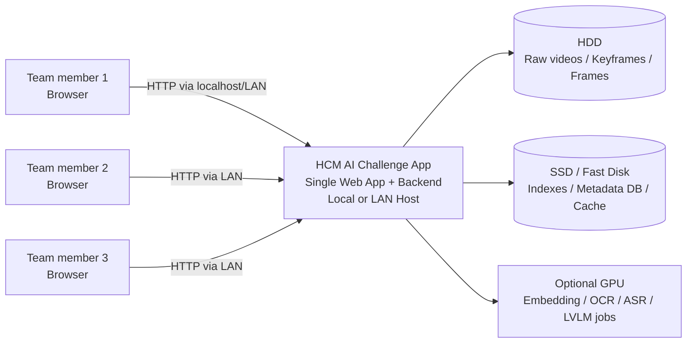

---

## 2. High-Level Modular Monolith Architecture

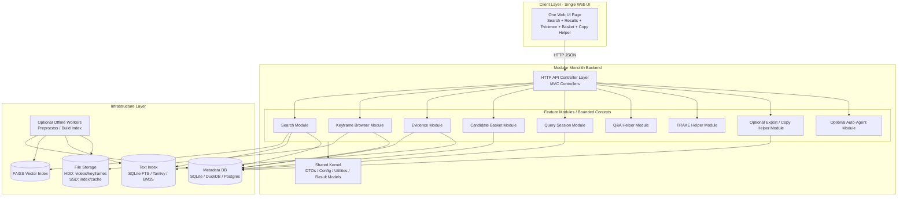

---

## 3. Layered Architecture + Clean Architecture

```mermaid
flowchart TB
    subgraph Presentation["Presentation Layer"]
        WebUI[Single Web UI]
        Controllers[FastAPI Controllers / Routes]
    end

    subgraph Application["Application Layer - Use Cases"]
        SearchUC[Search Use Case]
        BrowseUC[Browse Same-Video Keyframes Use Case]
        EvidenceUC[Get Evidence Use Case]
        BasketUC[Save Candidate Use Case]
        CopyUC[Build Copy Output Use Case]
        QAUC[Q&A Answer Helper Use Case]
        TrakeUC[TRAKE Sequence Helper Use Case]
        AgentUC[Optional Auto Solve Use Case]
    end

    subgraph Domain["Domain Layer - Business Logic"]
        Query[Query / QuerySession]
        Candidate[Candidate]
        Keyframe[Keyframe]
        Video[Video]
        Evidence[Evidence]
        SearchResult[SearchResult]
        Answer[Answer]
        TrakeSeq[TrakeSequence]
        Scoring[Ranking / Fusion Policy]
    end

    subgraph Infrastructure["Infrastructure Layer"]
        Repos[Repositories]
        VectorGateway[Vector Search Gateway]
        TextGateway[Text Search Gateway]
        FileGateway[File Storage Gateway]
        ModelGateway[Optional Model Gateway]
        DB[(Metadata DB)]
        FAISS[(FAISS)]
        TextIndex[(Text Index)]
        HDD[(HDD Storage)]
    end

    WebUI --> Controllers
    Controllers --> SearchUC
    Controllers --> BrowseUC
    Controllers --> EvidenceUC
    Controllers --> BasketUC
    Controllers --> CopyUC
    Controllers --> QAUC
    Controllers --> TrakeUC
    Controllers --> AgentUC

    SearchUC --> Query
    SearchUC --> SearchResult
    SearchUC --> Scoring
    BrowseUC --> Keyframe
    EvidenceUC --> Evidence
    BasketUC --> Candidate
    CopyUC --> Candidate
    QAUC --> Answer
    TrakeUC --> TrakeSeq

    SearchUC --> VectorGateway
    SearchUC --> TextGateway
    SearchUC --> Repos
    BrowseUC --> FileGateway
    EvidenceUC --> Repos
    EvidenceUC --> TextGateway
    QAUC --> ModelGateway
    TrakeUC --> Repos

    Repos --> DB
    VectorGateway --> FAISS
    TextGateway --> TextIndex
    FileGateway --> HDD
```

---

## 4. MVC Mapping

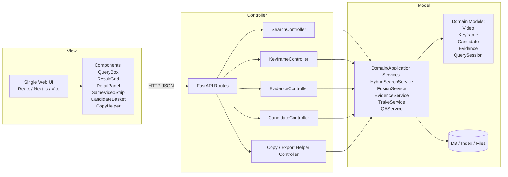

---

## 5. DDD Bounded Contexts

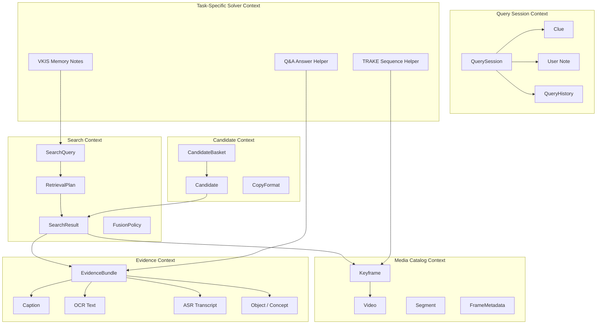

---

## 6. Single Web UI Component Layout

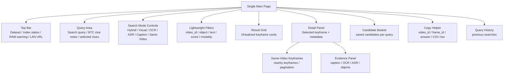

---

## 7. Search Flow

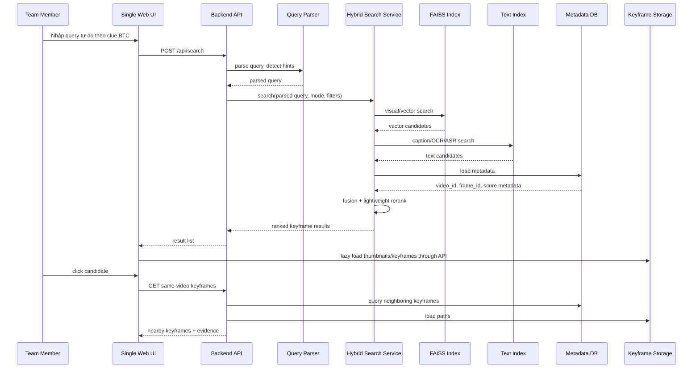

---

## 8. Keyframe-First Browse Flow

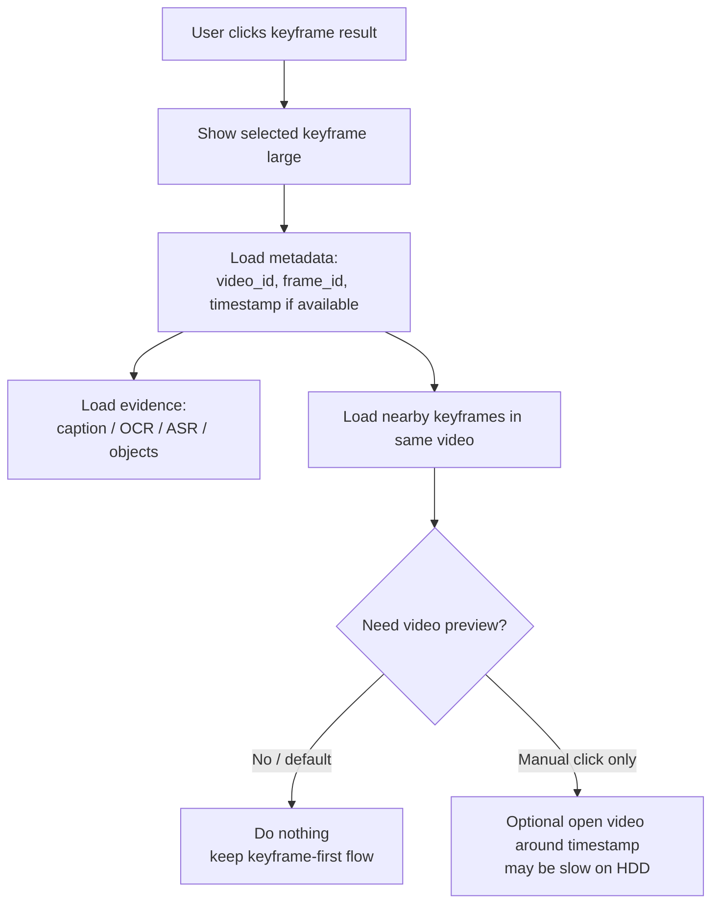

---

## 9. Candidate + Copy Helper Flow

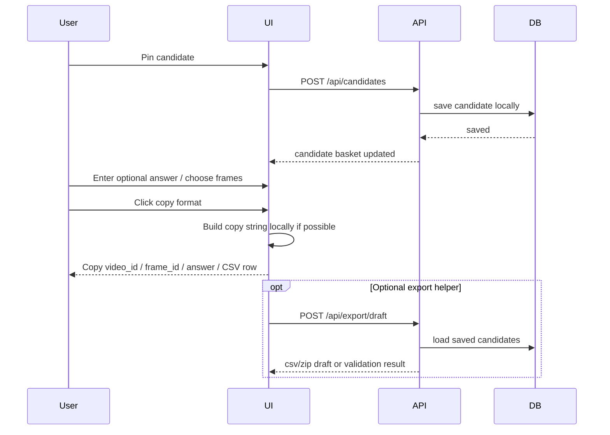

---

## 10. Query Session Flow for Progressive Clues

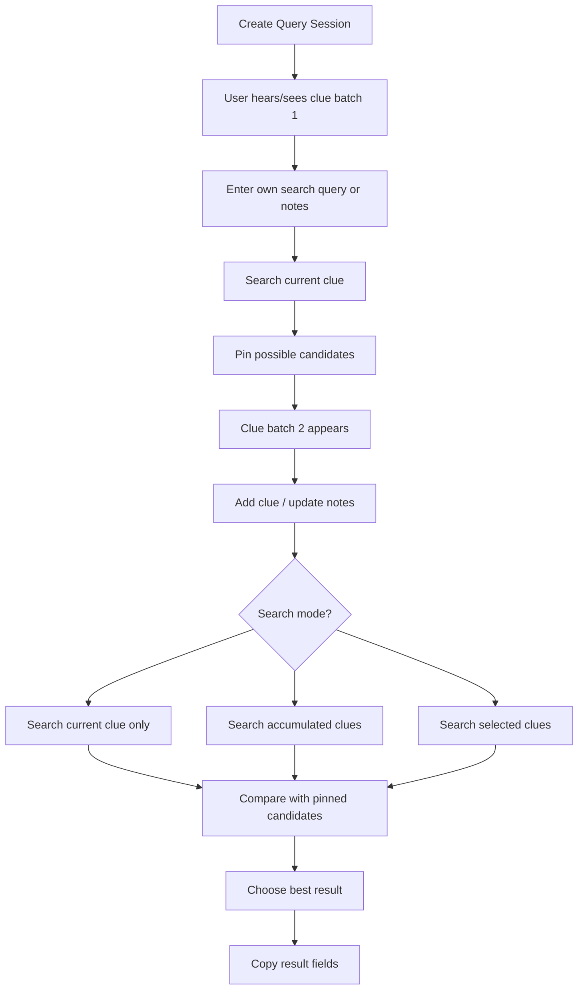

---

## 11. Offline Preprocessing Pipeline

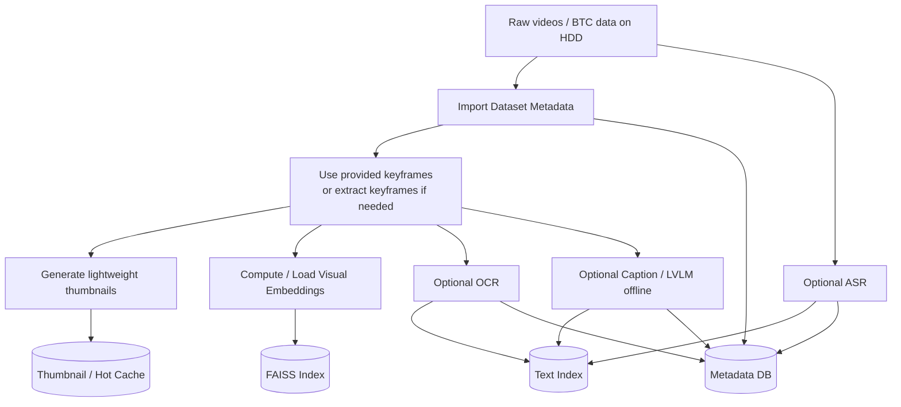

---

## 12. Runtime Deployment

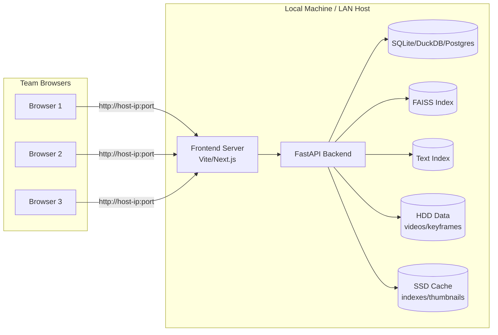

---

## 13. Recommended Backend Module Structure

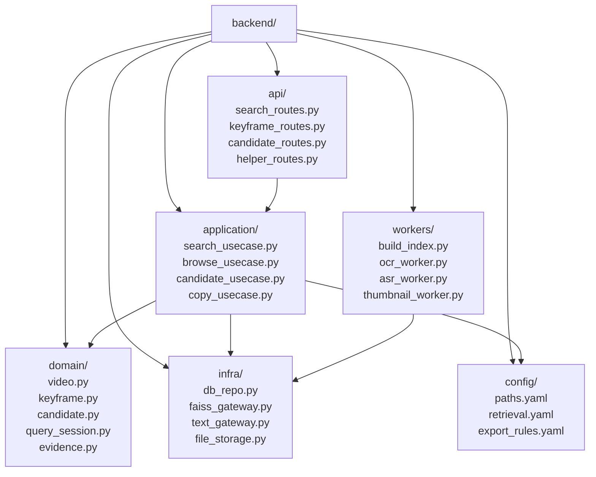

---

## 14. Recommended Frontend Component Structure

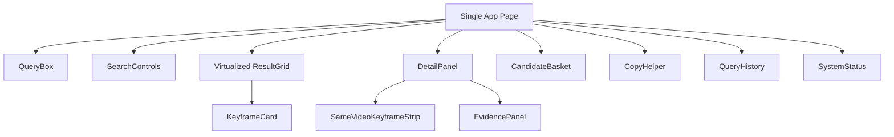

---

## 15. Architectural Rule Summary

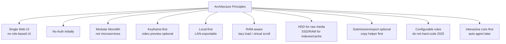

---

Kiến trúc chốt nên là:

```text
Single Web UI
+ Modular Monolith Backend
+ Clean Architecture internally
+ DDD-style bounded contexts
+ MVC at presentation/API layer
+ Keyframe-first retrieval workflow
+ Local/LAN deployment
+ Configurable copy/export helper
```

## Dưới đây là **1 code Mermaid duy nhất** cho toàn hệ thống, theo hướng: single Web UI, modular monolith, MVC + layered + DDD + clean architecture, local/LAN, keyframe-first, RAM-aware, export/submission chỉ là helper cấu hình được vì luật 2026 chưa chốt

```mermaid
flowchart TB
    %% =========================================================
    %% HCM AI Challenge 2026 - Multimedia Analysis & Retrieval Assistant
    %% Architecture style:
    %% - Modular Monolith
    %% - MVC at API/UI boundary
    %% - Layered Architecture
    %% - Clean Architecture internally
    %% - DDD-inspired bounded contexts
    %% - Single Web UI, no Auth, local-first / LAN-exportable
    %% =========================================================

    %% =========================
    %% External Users / Runtime
    %% =========================
    subgraph USERS["Team Members - Browser Clients"]
        U1["Teammate Browser 1"]
        U2["Teammate Browser 2"]
        U3["Teammate Browser N"]
    end

    subgraph HOST["Local Machine / LAN Host"]
        direction TB

        %% =========================
        %% PRESENTATION / VIEW
        %% =========================
        subgraph PRESENTATION["Presentation Layer / MVC View"]
            UI["Single Web UI Page<br/>No role split - shared by all teammates"]

            subgraph UI_COMPONENTS["UI Components on the same page"]
                QueryBox["Query / Notes Area<br/>- user search query<br/>- BTC clue notes<br/>- current / accumulated / selected clues"]
                SearchControls["Search Controls<br/>Hybrid / Visual / Caption / OCR / ASR / Object / Same-video"]
                ResultGrid["Virtualized Result Grid<br/>Keyframe-first results<br/>lazy-loaded thumbnails"]
                DetailPanel["Detail Panel<br/>selected keyframe<br/>video_id / frame_id / metadata"]
                SameVideoStrip["Same-video Keyframe Strip<br/>nearby keyframes / pagination<br/>video preview optional"]
                EvidencePanel["Evidence Panel<br/>caption / OCR / ASR / objects / metadata"]
                Basket["Candidate Basket<br/>saved candidates per query/session"]
                CopyHelper["Copy / Output Helper<br/>video_id<br/>frame_id<br/>answer<br/>CSV row if needed"]
                History["Query History<br/>previous searches / clue attempts"]
                Status["System Status<br/>dataset / index / RAM warning / LAN URL"]
            end

            UI --> Status
            UI --> QueryBox
            UI --> SearchControls
            UI --> ResultGrid
            UI --> DetailPanel
            DetailPanel --> SameVideoStrip
            DetailPanel --> EvidencePanel
            UI --> Basket
            UI --> CopyHelper
            UI --> History
        end

        %% =========================
        %% CONTROLLERS
        %% =========================
        subgraph CONTROLLERS["Controller Layer / MVC Controllers"]
            API["FastAPI Backend Gateway"]

            SearchController["SearchController<br/>POST /api/search"]
            KeyframeController["KeyframeController<br/>GET /api/keyframes<br/>GET /api/same-video"]
            EvidenceController["EvidenceController<br/>GET /api/evidence"]
            SessionController["QuerySessionController<br/>current / accumulated / selected clues"]
            CandidateController["CandidateController<br/>pin / unpin / basket"]
            HelperController["CopyExportHelperController<br/>copy row / validate draft / optional csv zip"]
            AgentController["Optional AgentController<br/>automatic mode later"]
        end

        %% =========================
        %% APPLICATION USE CASES
        %% =========================
        subgraph APPLICATION["Application Layer / Clean Architecture Use Cases"]
            SearchUC["SearchUseCase<br/>run exploratory search from user's own query"]
            BrowseUC["BrowseSameVideoUseCase<br/>load keyframes from same video"]
            EvidenceUC["GetEvidenceUseCase<br/>collect caption OCR ASR object metadata"]
            SessionUC["ManageQuerySessionUseCase<br/>progressive clue workflow"]
            BasketUC["ManageCandidateBasketUseCase"]
            CopyUC["BuildCopyOutputUseCase<br/>video_id / frame_id / answer / row"]
            QAUC["QAHelperUseCase<br/>answer suggestion / normalization"]
            TrakeUC["TRAKEHelperUseCase<br/>ordered frame sequence helper"]
            VKISUC["VKISMemoryQueryUseCase<br/>manual visual prompt notes to query"]
            AgentUC["OptionalAutoSolveUseCase<br/>same core tools, not separate system"]
        end

        %% =========================
        %% DOMAIN / DDD
        %% =========================
        subgraph DOMAIN["Domain Layer / DDD-Inspired Bounded Contexts"]
            direction TB

            subgraph SearchBC["Search Context"]
                SearchQuery["SearchQuery"]
                RetrievalPlan["RetrievalPlan"]
                SearchResult["SearchResult"]
                FusionPolicy["FusionPolicy"]
                RankingPolicy["RankingPolicy"]
            end

            subgraph MediaBC["Media Catalog Context"]
                Video["Video<br/>video_id / path / duration"]
                Keyframe["Keyframe<br/>frame_id / timestamp / image_path"]
                Segment["Segment / Shot"]
                FrameMetadata["FrameMetadata"]
            end

            subgraph EvidenceBC["Evidence Context"]
                Caption["Caption"]
                OCRText["OCRText"]
                ASRText["ASRTranscript"]
                ObjectConcept["Object / Concept"]
                EvidenceBundle["EvidenceBundle"]
            end

            subgraph SessionBC["Query Session Context"]
                QuerySession["QuerySession"]
                Clue["Clue<br/>current / accumulated / selected"]
                Note["UserNote"]
                QueryHistory["QueryHistory"]
            end

            subgraph CandidateBC["Candidate Context"]
                Candidate["Candidate"]
                CandidateBasket["CandidateBasket"]
                CopyFormat["CopyFormat"]
            end

            subgraph SolverBC["Task-Specific Solver Context"]
                QAAnswer["QAAnswer<br/>answer + constraints"]
                TrakeSequence["TrakeSequence<br/>same-video ordered frames"]
                VKISNotes["VKISNotes<br/>scene people objects actions colors text"]
            end

            SearchQuery --> RetrievalPlan
            RetrievalPlan --> SearchResult
            SearchResult --> FusionPolicy
            SearchResult --> RankingPolicy
            SearchResult --> Keyframe
            Keyframe --> Video
            Keyframe --> FrameMetadata
            EvidenceBundle --> Caption
            EvidenceBundle --> OCRText
            EvidenceBundle --> ASRText
            EvidenceBundle --> ObjectConcept
            SearchResult --> EvidenceBundle
            Candidate --> SearchResult
            CandidateBasket --> Candidate
            QuerySession --> Clue
            QuerySession --> Note
            QuerySession --> QueryHistory
            QAAnswer --> EvidenceBundle
            TrakeSequence --> Keyframe
            VKISNotes --> SearchQuery
        end

        %% =========================
        %% DOMAIN / APPLICATION SERVICES
        %% =========================
        subgraph SERVICES["Domain & Application Services"]
            QueryParser["QueryParserService<br/>lightweight rule-based first<br/>optional LLM later"]
            RetrievalPlanner["RetrievalPlannerService<br/>choose visual/caption/OCR/ASR/object search"]
            HybridSearch["HybridSearchService"]
            FusionService["FusionAndRerankService<br/>RAM-aware lightweight rerank"]
            SameVideoService["SameVideoKeyframeService"]
            EvidenceService["EvidenceService"]
            AnswerService["QAAnswerHelperService"]
            TrakeService["TRAKETimelineHelperService"]
            VKISService["VKISMemoryToQueryService"]
            CopyService["CopyOutputService"]
        end

        %% =========================
        %% INFRASTRUCTURE GATEWAYS
        %% =========================
        subgraph INFRA["Infrastructure Layer / Adapters"]
            Repos["Repositories<br/>metadata / sessions / candidates"]
            VectorGateway["VectorSearchGateway<br/>FAISS adapter"]
            TextGateway["TextSearchGateway<br/>SQLite FTS / Tantivy / BM25 adapter"]
            FileGateway["FileStorageGateway<br/>keyframes / thumbnails / videos"]
            ModelGateway["OptionalModelGateway<br/>embedding / OCR / ASR / LVLM offline or controlled"]
            ConfigGateway["ConfigGateway<br/>paths / retrieval weights / export rules"]
        end

        %% =========================
        %% DATA / STORAGE
        %% =========================
        subgraph STORAGE["Data / Index / Storage Layer"]
            DB[("Metadata DB<br/>SQLite / DuckDB / Postgres<br/>videos, keyframes, evidence, sessions, basket")]
            FAISS[("Vector Index<br/>FAISS<br/>visual embeddings")]
            TEXTIDX[("Text Index<br/>caption / OCR / ASR / metadata")]
            SSD[("SSD / Fast Disk<br/>indexes / metadata / hot cache")]
            HDD[("HDD<br/>raw videos / keyframes / frames")]
            CACHE[("LRU Cache<br/>recent thumbnails / recent results")]
        end

        %% =========================
        %% OFFLINE PROCESSING
        %% =========================
        subgraph OFFLINE["Offline Processing / Worker Scripts"]
            ImportWorker["Dataset Importer<br/>read BTC files / metadata"]
            KeyframeWorker["Keyframe Loader or Extractor<br/>prefer provided keyframes"]
            ThumbWorker["Thumbnail Generator<br/>small images for UI"]
            EmbedWorker["Embedding Builder<br/>visual vectors"]
            OCRWorker["Optional OCR Worker"]
            ASRWorker["Optional ASR Worker"]
            CaptionWorker["Optional Caption / LVLM Worker"]
            IndexWorker["Index Builder<br/>FAISS + text index"]
        end
    end

    %% =========================
    %% Browser to Host communication
    %% =========================
    U1 -->|"HTTP via localhost/LAN"| UI
    U2 -->|"HTTP via LAN"| UI
    U3 -->|"HTTP via LAN"| UI

    %% =========================
    %% UI to Controllers
    %% =========================
    UI -->|"HTTP JSON<br/>minimal payloads"| API
    API --> SearchController
    API --> KeyframeController
    API --> EvidenceController
    API --> SessionController
    API --> CandidateController
    API --> HelperController
    API --> AgentController

    %% =========================
    %% Controllers to Use Cases
    %% =========================
    SearchController --> SearchUC
    KeyframeController --> BrowseUC
    EvidenceController --> EvidenceUC
    SessionController --> SessionUC
    CandidateController --> BasketUC
    HelperController --> CopyUC
    HelperController --> QAUC
    HelperController --> TrakeUC
    AgentController --> AgentUC

    %% =========================
    %% Use Cases to Domain
    %% =========================
    SearchUC --> SearchQuery
    SearchUC --> SearchResult
    SearchUC --> RetrievalPlan
    BrowseUC --> Keyframe
    EvidenceUC --> EvidenceBundle
    SessionUC --> QuerySession
    BasketUC --> CandidateBasket
    CopyUC --> CopyFormat
    QAUC --> QAAnswer
    TrakeUC --> TrakeSequence
    VKISUC --> VKISNotes
    AgentUC --> SearchQuery
    AgentUC --> RetrievalPlan

    %% =========================
    %% Use Cases to Services
    %% =========================
    SearchUC --> QueryParser
    SearchUC --> RetrievalPlanner
    SearchUC --> HybridSearch
    SearchUC --> FusionService
    BrowseUC --> SameVideoService
    EvidenceUC --> EvidenceService
    QAUC --> AnswerService
    TrakeUC --> TrakeService
    VKISUC --> VKISService
    CopyUC --> CopyService
    AgentUC --> QueryParser
    AgentUC --> RetrievalPlanner
    AgentUC --> HybridSearch
    AgentUC --> FusionService
    AgentUC --> EvidenceService

    %% =========================
    %% Services to Infrastructure
    %% =========================
    QueryParser --> ConfigGateway
    RetrievalPlanner --> ConfigGateway
    HybridSearch --> VectorGateway
    HybridSearch --> TextGateway
    HybridSearch --> Repos
    FusionService --> Repos
    SameVideoService --> Repos
    SameVideoService --> FileGateway
    EvidenceService --> Repos
    EvidenceService --> TextGateway
    EvidenceService --> FileGateway
    AnswerService --> EvidenceService
    AnswerService --> ModelGateway
    TrakeService --> Repos
    TrakeService --> SameVideoService
    VKISService --> QueryParser
    VKISService --> HybridSearch
    CopyService --> ConfigGateway
    CopyService --> Repos

    %% =========================
    %% Infrastructure to Storage
    %% =========================
    Repos --> DB
    VectorGateway --> FAISS
    TextGateway --> TEXTIDX
    FileGateway --> HDD
    FileGateway --> SSD
    FileGateway --> CACHE
    ConfigGateway --> SSD
    ModelGateway --> SSD
    ModelGateway --> HDD

    %% =========================
    %% Offline Processing to Storage
    %% =========================
    ImportWorker --> HDD
    ImportWorker --> DB
    KeyframeWorker --> HDD
    KeyframeWorker --> DB
    ThumbWorker --> HDD
    ThumbWorker --> SSD
    ThumbWorker --> CACHE
    EmbedWorker --> HDD
    EmbedWorker --> FAISS
    OCRWorker --> HDD
    OCRWorker --> TEXTIDX
    OCRWorker --> DB
    ASRWorker --> HDD
    ASRWorker --> TEXTIDX
    ASRWorker --> DB
    CaptionWorker --> HDD
    CaptionWorker --> TEXTIDX
    CaptionWorker --> DB
    IndexWorker --> DB
    IndexWorker --> FAISS
    IndexWorker --> TEXTIDX
    IndexWorker --> SSD

    %% =========================
    %% Key Runtime Flows
    %% =========================
    QueryBox -. "User enters own query from BTC clue, not necessarily exact prompt" .-> SearchController
    ResultGrid -. "Lazy load thumbnails / virtual scroll to save RAM" .-> FileGateway
    DetailPanel -. "Keyframe-first inspection" .-> SameVideoService
    SameVideoStrip -. "Open nearby keyframes in same video" .-> FileGateway
    EvidencePanel -. "Inspect caption OCR ASR object evidence" .-> EvidenceService
    CopyHelper -. "Copy video_id / frame_id / answer / row; export optional" .-> CopyService

    %% =========================
    %% Architecture Constraints
    %% =========================
    ARCH["Architecture Rules<br/>1. Single Web UI, no role-based UI<br/>2. No Auth initially<br/>3. Modular monolith, not microservices<br/>4. Local-first, LAN-exportable<br/>5. Keyframe-first, video preview optional<br/>6. HDD for raw media, SSD/RAM for indexes/cache<br/>7. RAM-aware: lazy load, pagination, virtualized grid<br/>8. Copy helper first; submission/export configurable<br/>9. Interactive core first; auto-agent optional later<br/>10. Do not hard-code prior-year rules"]
    ARCH -.-> UI
    ARCH -.-> API
    ARCH -.-> STORAGE
```
