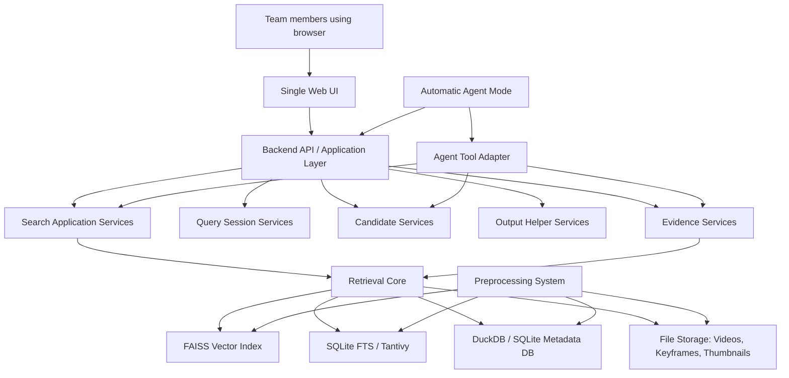
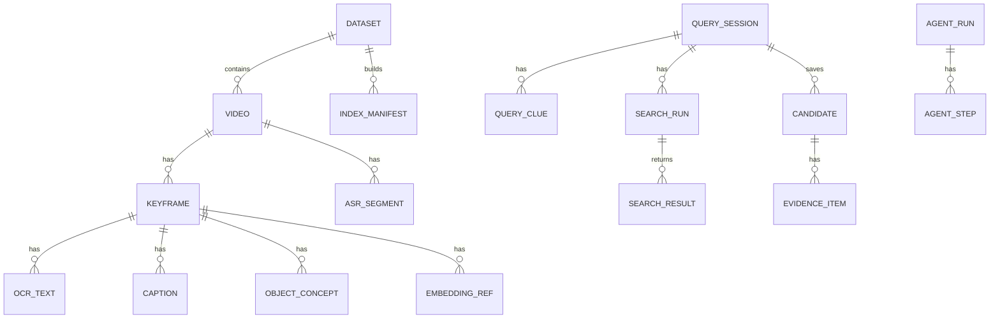
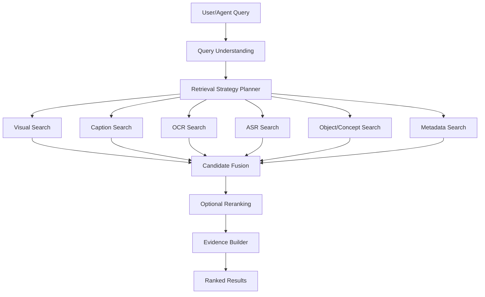
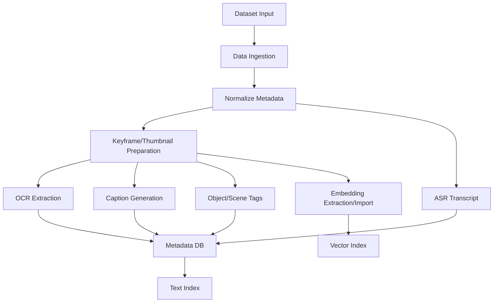
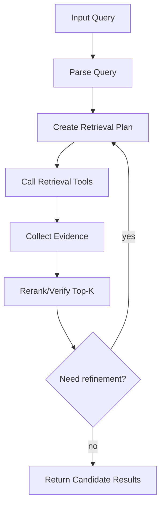

# SPEC.md
# AI Challenge HCMC 2026 Multimedia Retrieval Assistant

Version: 0.1.0  
Status: Draft for architecture/design review  
Primary owner: TBD  
Last updated: 2026-06-12

---

## 0. Executive Summary

This document specifies a local-first multimedia retrieval assistant for AI Challenge HCMC 2026 with the theme:

> Intelligent Virtual Assistant for Advanced Analysis and Information Retrieval from Large-Scale Multimedia Data

The system is designed to help a team search, inspect, reason over, and copy candidate answers from a large multimedia dataset containing videos, keyframes, images, audio, transcripts, OCR text, embeddings, object concepts, captions, and metadata.

The product must support two operating modes:

1. **Interactive Mode**: human-in-the-loop search through a single shared Web UI.
2. **Automatic Agent Mode**: an agent-in-the-loop workflow where an agent uses the same retrieval core, evidence engine, and storage layer to perform multi-step search and reasoning.

The system must not be split into separate products for humans and agents. The agent is an automation layer on top of the same tools that the human UI uses.

The preferred architecture is a **local-first modular monolith** using clean architecture, layered architecture, DDD-inspired modules, and MVC-style presentation organization. The system should run on a single laptop, local GPU workstation, or mini server, and can be exposed over LAN so teammates can access the same Web UI through browsers.

The system prioritizes:

- simplicity;
- debuggability;
- RAM efficiency;
- SSD efficiency;
- local operation;
- low dependency count;
- keyframe-first interaction;
- fast retrieval over raw video playback;
- configurable output/export because final 2026 submission rules are not fully fixed.

---

## 1. Product Vision

### 1.1 Vision Statement

Build a lightweight, local-first multimedia analysis and retrieval assistant that helps a competition team find the right videos, keyframes, frame IDs, answers, and event sequences from a large multimedia dataset under time pressure.

The system should behave like a practical competition workbench:

- humans can search using their own translated, shortened, expanded, or partial queries;
- users can accumulate clues as the contest reveals them;
- users can browse keyframes and nearby keyframes in the same video;
- users can inspect evidence from captions, OCR, ASR, objects, metadata, embeddings, and optional agent reasoning;
- users can save promising candidates;
- users can copy useful output fields such as `video_id`, `frame_id`, `answer`, TRAKE frame sequences, or CSV rows;
- an automatic agent can use the same tools to perform end-to-end retrieval and reasoning.

### 1.2 Product Goals

The product aims to optimize for competition effectiveness rather than general-purpose media management.

Primary goals:

1. **Fast Search**: return useful ranked keyframes quickly from multiple modalities.
2. **Fast Inspection**: allow users to inspect a selected keyframe and nearby keyframes without loading full videos by default.
3. **Evidence-Aware Results**: show why each candidate might match the query.
4. **Flexible Querying**: support exact queries, partial clues, user-written notes, translated queries, and iterative search.
5. **Shared Team Access**: allow multiple teammates to access the same local system through LAN using a browser.
6. **Local-First Operation**: run without requiring cloud infrastructure or external search services.
7. **Agent Compatibility**: enable an agent to call retrieval and evidence tools without duplicating logic.
8. **Configurable Export**: support copying/exporting results without assuming a fixed 2026 submission interface.

### 1.3 Non-Goals

The following are not goals for the first major version:

- full multi-tenant authentication;
- role-based dashboards;
- separate operator/reviewer/admin UI products;
- distributed microservices;
- Elasticsearch/OpenSearch as a mandatory dependency;
- real-time full-video streaming as the primary workflow;
- loading all keyframes or videos into RAM;
- building a general video annotation platform;
- hard-coding the 2025 submission format as the only possible format;
- building a chatbot-only solution without a strong retrieval UI.

### 1.4 Competition Context Assumptions

The system is based on the known 2026 theme and prior-year patterns. Prior-year formats should guide design, but must not be treated as final 2026 law.

Known query families to support:

- Textual KIS;
- Q&A;
- TRAKE;
- VKIS / Video KIS.

Expected candidate output fields:

- `video_id` or video name;
- `frame_id`;
- answer text for Q&A;
- ordered frame sequence for TRAKE;
- evidence/metadata.

The system must keep submission/export configurable because the final 2026 interface could be manual CSV upload, web form input, Codabench-style packaging, API submission, or a live contest interface.

---

## 2. Requirement Levels

This document uses the following requirement keywords:

- **MUST**: required for the system to satisfy the spec.
- **SHOULD**: strongly recommended, but can be deferred if time or resources are limited.
- **MAY**: optional enhancement.
- **MUST NOT**: forbidden or explicitly out of scope.

---

## 3. Functional Requirements

### 3.1 Global Functional Requirements

FR-001. The system MUST provide a single shared Web UI for all teammates.  
FR-002. The system MUST run locally on one machine and MAY be exposed over LAN.  
FR-003. The system MUST NOT require authentication for the initial competition version.  
FR-004. The system MUST NOT require role-based UI separation.  
FR-005. The system MUST use one common retrieval core for both Interactive Mode and Automatic Agent Mode.  
FR-006. The system MUST support keyframe-first search and inspection.  
FR-007. The system SHOULD support raw video access only as an optional preview/helper.  
FR-008. The system MUST support incremental and exploratory querying, where the user query is not necessarily identical to the contest query.  
FR-009. The system MUST allow users to save/pin candidate results.  
FR-010. The system MUST allow users to copy important candidate fields.  
FR-011. The system SHOULD support configurable output/export helpers.  
FR-012. The system MUST keep data ingestion and validation configurable because 2026 data format is not fully known.

### 3.2 Preprocessing System Requirements

FR-PRE-001. The system MUST import dataset folders from local disk, mounted drives, or downloaded sources.  
FR-PRE-002. The system SHOULD support input folders containing raw videos.  
FR-PRE-003. The system SHOULD support input folders containing keyframes.  
FR-PRE-004. The system SHOULD support metadata files such as video title, description, YouTube link, channel/source, duration, fps, and provided annotations.  
FR-PRE-005. The system SHOULD support provided object detection JSON files.  
FR-PRE-006. The system SHOULD support provided CLIP/keyframe embedding files.  
FR-PRE-007. The system MUST normalize all supported dataset inputs into an internal metadata model.  
FR-PRE-008. The system SHOULD generate thumbnails if they are not provided.  
FR-PRE-009. The system SHOULD generate or import captions for keyframes or segments.  
FR-PRE-010. The system SHOULD generate or import OCR text from keyframes.  
FR-PRE-011. The system SHOULD generate or import ASR transcripts from video audio.  
FR-PRE-012. The system SHOULD generate or import object concepts and scene tags.  
FR-PRE-013. The system SHOULD generate or import embeddings for visual, text, audio, and object data where useful.  
FR-PRE-014. The system MUST build a metadata database.  
FR-PRE-015. The system MUST build one or more vector indexes.  
FR-PRE-016. The system SHOULD build a text search index.  
FR-PRE-017. The system MUST be able to run preprocessing in batch mode from CLI scripts.  
FR-PRE-018. The system SHOULD support resumable preprocessing to avoid restarting long jobs.

### 3.3 Retrieval Assistant Requirements

FR-RET-001. The system MUST allow users to search with free-form text.  
FR-RET-002. The system MUST support hybrid retrieval from visual embeddings, captions, OCR, ASR, object concepts, and metadata if available.  
FR-RET-003. The system MUST show ranked keyframe results in a grid.  
FR-RET-004. The system SHOULD show ranked video-level results or group frames by video.  
FR-RET-005. The system MUST allow users to inspect a selected keyframe.  
FR-RET-006. The system MUST allow users to browse keyframes near the selected keyframe within the same video.  
FR-RET-007. The system SHOULD support searching within the same video.  
FR-RET-008. The system SHOULD support similar-frame search from a selected keyframe.  
FR-RET-009. The system MUST show evidence for results when available.  
FR-RET-010. The system SHOULD support filters such as modality, video ID, object, metadata, score range, and result grouping.  
FR-RET-011. The system SHOULD support configurable ranking strategy and fusion weights.  
FR-RET-012. The system MUST support query sessions with current clue, accumulated clues, selected clues, and notes.  
FR-RET-013. The system MUST allow pinned candidates to persist across query refinements within a session.

### 3.4 Query Type Requirements

FR-QT-001. The system MUST support Textual KIS workflows.  
FR-QT-002. The system MUST support Q&A workflows with answer input and answer helper.  
FR-QT-003. The system MUST support TRAKE workflows for ordered frame sequences in one video.  
FR-QT-004. The system MUST support VKIS workflows where the user describes a seen visual/video prompt in text.  
FR-QT-005. The system SHOULD allow users to label or change the query type manually.  
FR-QT-006. The system MAY infer query type automatically.

### 3.5 Interactive Mode Requirements

FR-INT-001. The system MUST provide a single-page interface for query input, search controls, results, details, evidence, candidates, and output helper.  
FR-INT-002. The system MUST allow users to type their own search queries, not only paste official contest queries.  
FR-INT-003. The system SHOULD support current clue vs accumulated clues search.  
FR-INT-004. The system SHOULD support selected-clue search.  
FR-INT-005. The system MUST allow users to save promising candidates.  
FR-INT-006. The system MUST allow users to copy `video_id`, `frame_id`, answer, and CSV-like rows.  
FR-INT-007. The system SHOULD support keyboard shortcuts for fast competition use.  
FR-INT-008. The system SHOULD avoid loading expensive UI panels until needed.

### 3.6 Automatic Agent Mode Requirements

FR-AG-001. The system MUST expose retrieval and evidence tools for agent use.  
FR-AG-002. The agent MUST use the same retrieval core as the Web UI.  
FR-AG-003. The agent MUST NOT directly bypass the retrieval/evidence/storage abstractions unless explicitly required for performance.  
FR-AG-004. The agent SHOULD parse query intent and choose retrieval strategies.  
FR-AG-005. The agent SHOULD perform multi-step retrieval, reranking, refinement, and reasoning.  
FR-AG-006. Agent results MUST be displayed in the same Web UI result model as interactive search results.  
FR-AG-007. Agent reasoning SHOULD be shown as optional evidence.  
FR-AG-008. Agent runs SHOULD be logged for debugging.  
FR-AG-009. Agent behavior SHOULD be bounded and configurable to control latency and resource usage.

### 3.7 Output Helper Requirements

FR-OUT-001. The system MUST allow copying `video_id`.  
FR-OUT-002. The system MUST allow copying `frame_id`.  
FR-OUT-003. The system MUST allow copying `video_id,frame_id`.  
FR-OUT-004. The system SHOULD allow copying `video_id,frame_id,answer`.  
FR-OUT-005. The system SHOULD allow copying TRAKE rows such as `video_id,frame_1,frame_2,...`.  
FR-OUT-006. The system MAY export CSV files and ZIP packages if the final competition format requires them.  
FR-OUT-007. Export formats MUST be configurable.  
FR-OUT-008. Export must be treated as a helper, not the core system assumption.

---

## 4. Non-Functional Requirements

### 4.1 Performance

NFR-PERF-001. The system MUST support RAM-constrained operation on 16-32GB RAM.  
NFR-PERF-002. The system MUST avoid loading all keyframes into RAM.  
NFR-PERF-003. The system MUST avoid caching raw videos in RAM.  
NFR-PERF-004. The Web UI MUST use lazy loading for images.  
NFR-PERF-005. The result grid MUST use virtualization or pagination for large result sets.  
NFR-PERF-006. The first useful results SHOULD appear quickly after a search.  
NFR-PERF-007. Heavy reranking or agent analysis SHOULD run only on a limited top-K candidate set.  
NFR-PERF-008. Same-video browsing SHOULD load a limited window of keyframes instead of the entire video.

### 4.2 Storage Efficiency

NFR-STOR-001. Raw videos SHOULD live on HDD.  
NFR-STOR-002. Keyframes MAY live on HDD if SSD is limited.  
NFR-STOR-003. Vector indexes, metadata DB, and hot text indexes SHOULD live on SSD where possible.  
NFR-STOR-004. The system SHOULD support thumbnail generation to reduce UI load.  
NFR-STOR-005. The system SHOULD avoid duplicating raw media files.  
NFR-STOR-006. Preprocessing outputs SHOULD be deterministic and cacheable.

### 4.3 Reliability

NFR-REL-001. The system SHOULD persist query sessions, notes, and candidates.  
NFR-REL-002. The system SHOULD support graceful degradation if optional indexes are missing.  
NFR-REL-003. The system MUST not crash if ASR/OCR/caption data is unavailable.  
NFR-REL-004. The system SHOULD provide index health checks.  
NFR-REL-005. The system SHOULD support simple backup of DB and index directories.

### 4.4 Maintainability

NFR-MAINT-001. The system MUST use modular monolith organization.  
NFR-MAINT-002. Domain modules SHOULD have clear boundaries.  
NFR-MAINT-003. Application logic SHOULD be separated from infrastructure details.  
NFR-MAINT-004. UI components SHOULD be reusable and testable.  
NFR-MAINT-005. Configurations SHOULD be externalized in YAML/JSON/TOML files.

### 4.5 Deployability

NFR-DEP-001. The system MUST run in local mode.  
NFR-DEP-002. The system MUST support LAN mode where other machines access the Web UI through a browser.  
NFR-DEP-003. The system SHOULD support simple startup via scripts.  
NFR-DEP-004. The system MAY support Docker Compose, but Docker should not become a hard blocker for local development.  
NFR-DEP-005. The system SHOULD be able to run offline after models and data are prepared.

### 4.6 Usability

NFR-USE-001. The UI MUST be a single shared Web UI.  
NFR-USE-002. The UI MUST avoid unnecessary panels and heavy components by default.  
NFR-USE-003. The UI SHOULD allow panels to be collapsed.  
NFR-USE-004. The UI SHOULD prioritize keyframe results over video playback.  
NFR-USE-005. Copy actions MUST be fast and visible.  
NFR-USE-006. Search iteration MUST be fast and low-friction.

---

## 5. User Stories

### 5.1 Interactive Search Stories

US-001. As a teammate, I want to enter my own simplified query based on the contest clue so that I can search quickly without copying the exact official text.

US-002. As a teammate, I want to store the current clue, accumulated clues, selected clues, and notes so that I can search differently as new clue batches are revealed.

US-003. As a teammate, I want to run hybrid search across visual, caption, OCR, ASR, objects, and metadata so that I can find candidates even when one modality fails.

US-004. As a teammate, I want to see ranked keyframes in a lightweight grid so that I can scan many visual candidates quickly.

US-005. As a teammate, I want to click a keyframe and see a larger view with metadata and evidence so that I can judge whether it matches the clue.

US-006. As a teammate, I want to see nearby keyframes from the same video so that I can verify context without loading the full video.

US-007. As a teammate, I want to search within the same video so that I can find the exact target frame after identifying the correct video.

US-008. As a teammate, I want to save promising candidates so that I do not lose them while trying new queries.

US-009. As a teammate, I want to copy `video_id`, `frame_id`, and CSV-like rows so that I can quickly submit or record answers in whatever format the contest requires.

### 5.2 Textual KIS Stories

US-010. As a user, I want to search using a natural language description so that I can find the target video or keyframe.

US-011. As a user, I want to split a long KIS clue into smaller search terms so that I can test different clue combinations.

US-012. As a user, I want to inspect which evidence matched my KIS query so that I can decide whether the result is plausible.

### 5.3 Q&A Stories

US-013. As a user, I want to enter a retrieval description and a question so that I can find the relevant video/keyframe and produce an answer.

US-014. As a user, I want the system to show possible answer evidence from OCR, ASR, captions, and nearby keyframes so that I can answer more accurately.

US-015. As a user, I want an answer helper that can normalize answer formats such as digits, uppercase, no spaces, and short strings so that I can reduce formatting mistakes.

### 5.4 TRAKE Stories

US-016. As a user, I want to define a sequence of events so that I can find matching ordered keyframes in the same video.

US-017. As a user, I want to select multiple candidate frames from one video and copy them as a TRAKE frame sequence.

US-018. As a user, I want the system to warn me when TRAKE frames are not in chronological order so that I can avoid invalid output.

### 5.5 VKIS Stories

US-019. As a user, I want to describe a shown video clip from memory using fields such as scene, people, objects, actions, colors, visible text, audio clues, and distinctive details so that I can search without importing the clip.

US-020. As a user, I want the system to expand my VKIS notes into multiple search queries so that I can find visual matches faster.

### 5.6 Agent Stories

US-021. As a user, I want to ask the agent to solve a query so that it can automatically plan searches and return candidate results.

US-022. As a user, I want agent results to appear in the same result grid and candidate model as manual search results so that I can inspect them normally.

US-023. As a developer, I want the agent to call the same retrieval and evidence APIs as the UI so that system behavior stays consistent and debuggable.

### 5.7 Preprocessing Stories

US-024. As a developer, I want to import a new dataset folder so that the system can create metadata and indexes.

US-025. As a developer, I want preprocessing jobs to be resumable so that long embedding/OCR/ASR tasks can continue after interruption.

US-026. As a developer, I want to reuse provided embeddings or metadata if available so that I do not waste compute.

---

## 6. System Architecture

### 6.1 Architecture Style

The system uses a **local-first modular monolith**.

Architectural principles:

- Clean Architecture: separate domain/application logic from infrastructure.
- Layered Architecture: Presentation, Application, Domain, Infrastructure.
- DDD-inspired modules: organize by domain capability.
- MVC for Presentation Layer: model/view/controller-style UI organization.
- Single Web UI: one shared interface, no separate role dashboards.
- Shared Retrieval Core: both UI and Agent call the same application services.

### 6.2 High-Level Component Diagram



### 6.3 Runtime Modes

#### Local Mode

```text
User browser -> localhost Web UI -> localhost Backend -> local DB/index/files
```

#### LAN Mode

```text
Teammate browser -> http://SERVER_LAN_IP:PORT -> Backend on server -> local DB/index/files
```

#### Optional Offline Mode

After models, data, and indexes are prepared, the system should be able to run without internet.

### 6.4 Main Systems

#### System 1: Preprocessing System

Purpose:

- ingest and normalize data;
- generate or import metadata;
- build indexes;
- prepare retrieval assets.

This system runs mostly before the contest, via CLI scripts or lightweight job runners.

#### System 2: Retrieval Assistant System

Purpose:

- serve the Web UI;
- run search;
- inspect evidence;
- manage candidates;
- help copy/export outputs;
- support agent workflows.

This system runs during practice and competition.

---

## 7. Domain Model

### 7.1 Core Domains

The system is organized around these DDD-inspired domains:

1. **Dataset Domain**
   - dataset import;
   - dataset version;
   - source paths;
   - media assets.

2. **Media Domain**
   - videos;
   - keyframes;
   - thumbnails;
   - audio tracks;
   - timeline mapping.

3. **Metadata Domain**
   - video metadata;
   - keyframe metadata;
   - captions;
   - OCR;
   - ASR;
   - object concepts;
   - scene tags.

4. **Index Domain**
   - vector indexes;
   - text indexes;
   - index manifests;
   - index versions.

5. **Retrieval Domain**
   - search request;
   - retrieval strategy;
   - candidate result;
   - modality-specific scores;
   - fusion and ranking.

6. **Evidence Domain**
   - evidence snippets;
   - match explanations;
   - OCR/ASR/caption/object evidence;
   - optional agent reasoning.

7. **Query Session Domain**
   - current clue;
   - accumulated clues;
   - selected clues;
   - notes;
   - query history;
   - pinned candidates.

8. **Candidate Domain**
   - saved candidate;
   - candidate basket;
   - candidate status;
   - selected answer/frame sequence.

9. **Output Helper Domain**
   - copy formats;
   - CSV row generation;
   - optional export;
   - configurable validation.

10. **Agent Domain**
    - agent run;
    - agent step;
    - tool call;
    - plan;
    - reasoning;
    - final candidates.

### 7.2 Important Domain Concepts

#### Dataset

A named collection of videos, keyframes, metadata, and indexes.

#### Video

A source video asset with stable ID/name and optional file path.

#### Keyframe

A representative frame with `frame_id`, `timestamp`, image path, thumbnail path, and metadata.

#### Search Query

A user-written query that may be exact, partial, translated, rewritten, or generated from clue notes.

#### Query Session

A workspace for one contest query, storing official clues, user notes, search history, and candidates.

#### Candidate

A possible answer candidate, usually linked to a video and frame, with scores and evidence.

#### Evidence

Structured proof explaining why a candidate may match the query.

#### Retrieval Strategy

A configuration describing which modalities to search and how to fuse their results.

#### Agent Run

A bounded automatic workflow that uses tools to search, inspect, refine, and return candidates.

---

## 8. Data Model

The data model should start simple and evolve as real dataset formats become clear.

### 8.1 Entity Overview



### 8.2 Tables / Collections

#### `datasets`

| Field | Type | Notes |
|---|---|---|
| `id` | string | dataset ID |
| `name` | string | human-readable name |
| `root_path` | string | base folder |
| `version` | string | dataset/index version |
| `created_at` | datetime | created time |
| `config_json` | json | ingestion config |

#### `videos`

| Field | Type | Notes |
|---|---|---|
| `id` | string | internal ID |
| `dataset_id` | string | FK |
| `video_name` | string | e.g. `L01_V028` |
| `file_path` | string | raw video path, optional |
| `title` | string | optional |
| `description` | text | optional |
| `source_url` | string | optional |
| `source_channel` | string | optional |
| `duration_sec` | float | optional |
| `fps` | float | optional |
| `frame_count` | integer | optional |
| `metadata_json` | json | flexible extra fields |

#### `keyframes`

| Field | Type | Notes |
|---|---|---|
| `id` | string | internal ID |
| `dataset_id` | string | FK |
| `video_name` | string | stable video name |
| `frame_id` | integer | official or normalized frame ID |
| `timestamp_sec` | float | derived if possible |
| `keyframe_index` | integer | index within video keyframes |
| `image_path` | string | full keyframe path |
| `thumbnail_path` | string | thumbnail path |
| `shot_id` | string | optional |
| `metadata_json` | json | flexible extra fields |

#### `captions`

| Field | Type | Notes |
|---|---|---|
| `id` | string | internal ID |
| `keyframe_id` | string | FK |
| `caption` | text | generated/provided caption |
| `language` | string | optional |
| `model_name` | string | generation source |
| `confidence` | float | optional |

#### `ocr_texts`

| Field | Type | Notes |
|---|---|---|
| `id` | string | internal ID |
| `keyframe_id` | string | FK |
| `text` | text | OCR text |
| `bbox_json` | json | optional bounding boxes |
| `confidence` | float | optional |
| `engine` | string | OCR engine |

#### `asr_segments`

| Field | Type | Notes |
|---|---|---|
| `id` | string | internal ID |
| `video_name` | string | video name |
| `start_time_sec` | float | start timestamp |
| `end_time_sec` | float | end timestamp |
| `start_frame_id` | integer | optional |
| `end_frame_id` | integer | optional |
| `text` | text | transcript |
| `language` | string | optional |
| `engine` | string | ASR engine |

#### `object_concepts`

| Field | Type | Notes |
|---|---|---|
| `id` | string | internal ID |
| `keyframe_id` | string | FK |
| `label` | string | object/concept label |
| `score` | float | confidence |
| `bbox_json` | json | optional |
| `source` | string | provided/generated |

#### `embedding_refs`

| Field | Type | Notes |
|---|---|---|
| `id` | string | internal ID |
| `target_type` | string | keyframe, caption, asr, ocr, object |
| `target_id` | string | target entity ID |
| `embedding_type` | string | visual, text, audio, etc. |
| `index_name` | string | vector index file |
| `vector_id` | integer | FAISS vector position |
| `model_name` | string | embedding model |
| `dimension` | integer | vector dimension |

#### `index_manifests`

| Field | Type | Notes |
|---|---|---|
| `id` | string | manifest ID |
| `dataset_id` | string | FK |
| `index_name` | string | logical name |
| `index_type` | string | faiss, sqlite_fts, tantivy |
| `file_path` | string | index path |
| `model_name` | string | if relevant |
| `dimension` | integer | if vector index |
| `created_at` | datetime | build time |
| `config_json` | json | build config |

#### `query_sessions`

| Field | Type | Notes |
|---|---|---|
| `id` | string | session ID |
| `dataset_id` | string | FK |
| `query_type` | string | tkis, qa, trake, vkis, unknown |
| `title` | string | optional |
| `notes` | text | private/team notes |
| `created_at` | datetime | created time |
| `updated_at` | datetime | updated time |

#### `query_clues`

| Field | Type | Notes |
|---|---|---|
| `id` | string | clue ID |
| `session_id` | string | FK |
| `order_index` | integer | clue order |
| `text` | text | clue text |
| `selected` | boolean | selected for search |
| `created_at` | datetime | created time |

#### `search_runs`

| Field | Type | Notes |
|---|---|---|
| `id` | string | run ID |
| `session_id` | string | FK optional |
| `query_text` | text | actual user-entered search query |
| `search_mode` | string | hybrid, visual, ocr, asr, etc. |
| `strategy_name` | string | retrieval strategy |
| `filters_json` | json | applied filters |
| `created_at` | datetime | run time |
| `latency_ms` | integer | search latency |

#### `search_results`

| Field | Type | Notes |
|---|---|---|
| `id` | string | result ID |
| `search_run_id` | string | FK |
| `rank` | integer | rank |
| `video_name` | string | candidate video |
| `frame_id` | integer | candidate frame |
| `keyframe_id` | string | optional FK |
| `score` | float | fused score |
| `scores_json` | json | modality scores |
| `evidence_json` | json | inline evidence summary |

#### `candidates`

| Field | Type | Notes |
|---|---|---|
| `id` | string | candidate ID |
| `session_id` | string | FK |
| `video_name` | string | selected video |
| `frame_id` | integer | selected frame |
| `answer` | text | optional Q&A answer |
| `trake_frames_json` | json | optional TRAKE sequence |
| `label` | string | maybe, maybe-not, final |
| `notes` | text | user notes |
| `created_at` | datetime | created time |

#### `agent_runs`

| Field | Type | Notes |
|---|---|---|
| `id` | string | run ID |
| `session_id` | string | optional FK |
| `input_query` | text | query given to agent |
| `status` | string | running, completed, failed |
| `final_result_json` | json | final candidates |
| `created_at` | datetime | created time |
| `latency_ms` | integer | total latency |

#### `agent_steps`

| Field | Type | Notes |
|---|---|---|
| `id` | string | step ID |
| `agent_run_id` | string | FK |
| `step_index` | integer | order |
| `tool_name` | string | tool called |
| `input_json` | json | tool input |
| `output_json` | json | tool output |
| `reasoning_summary` | text | safe summary |
| `latency_ms` | integer | step latency |

---

## 9. Storage Design

### 9.1 Storage Tiers

The system should separate storage by speed and size.

#### RAM

Use RAM for:

- currently loaded FAISS index if it fits;
- small metadata caches;
- current search results;
- currently visible thumbnails/keyframes;
- limited agent/retrieval intermediate data.

Do not use RAM for:

- all keyframes;
- full video files;
- unbounded thumbnail cache;
- large per-user browser state.

#### SSD

Use SSD for:

- metadata DB;
- vector indexes;
- text indexes;
- index manifests;
- hot cache;
- small thumbnails if affordable.

#### HDD

Use HDD for:

- raw videos;
- full keyframes;
- generated large media assets;
- cold backups.

### 9.2 Recommended Initial Storage Stack

| Purpose | Initial Choice | Reason |
|---|---|---|
| Metadata DB | DuckDB or SQLite | local, lightweight, easy to debug |
| Vector search | FAISS | fast local vector search |
| Text search | SQLite FTS or Tantivy | lower overhead than OpenSearch |
| File storage | Local filesystem | simple and local-first |
| Job state | SQLite/DuckDB or JSONL | simple resumability |
| Cache | in-process LRU initially | avoid Redis dependency at MVP |

### 9.3 File Layout

```text
data/
  datasets/
    aic2026/
      raw_videos/
      keyframes/
      thumbnails/
      audio/
      provided_metadata/
      generated/
        captions/
        ocr/
        asr/
        objects/
        embeddings/
      indexes/
        faiss/
        text/
      db/
        metadata.duckdb
      sessions/
      outputs/
      logs/
```

### 9.4 Index Manifest

Every index should have a manifest file:

```yaml
index_name: visual_keyframe_siglip_v1
dataset_id: aic2026
index_type: faiss
model_name: siglip-base-patch16
embedding_dimension: 768
vector_count: 1234567
created_at: "2026-06-12T10:00:00+07:00"
source_table: keyframes
mapping_file: visual_keyframe_siglip_v1.mapping.parquet
config:
  normalize_vectors: true
  metric: cosine
```

### 9.5 Mapping Files

FAISS only stores vectors. The system must maintain vector ID mappings:

```text
vector_id -> keyframe_id -> video_name, frame_id, timestamp, image_path, thumbnail_path
```

Recommended format:

- DuckDB table for query speed;
- Parquet/CSV backup for rebuild/debug.

---

## 10. Retrieval Architecture

### 10.1 Retrieval Core Overview



### 10.2 Search Modalities

#### Visual Search

Input:

- text query encoded into visual-language embedding;
- selected keyframe for similar-frame search;
- optional image embedding if allowed.

Output:

- ranked keyframes.

Uses:

- FAISS;
- CLIP/SigLIP/EVA-CLIP/provided embeddings.

#### Caption Search

Input:

- text query.

Output:

- keyframes or segments with matching captions.

Uses:

- SQLite FTS/Tantivy/BM25;
- optional text embeddings.

#### OCR Search

Input:

- text expected to appear on screen.

Output:

- keyframes with OCR matches.

Useful for:

- signs;
- slides;
- logos;
- names;
- numbers;
- places.

#### ASR Search

Input:

- words or concepts expected in speech/audio.

Output:

- video segments and nearby keyframes.

Useful for:

- interviews;
- speeches;
- news;
- narration;
- answer extraction.

#### Object/Concept Search

Input:

- labels or concepts.

Output:

- keyframes containing detected objects/concepts.

#### Metadata Search

Input:

- title/channel/description/source clues.

Output:

- videos or keyframes related to metadata matches.

### 10.3 Hybrid Fusion

A search result should maintain modality scores separately:

```json
{
  "video_name": "L01_V028",
  "frame_id": 25300,
  "score": 0.842,
  "scores": {
    "visual": 0.88,
    "caption": 0.72,
    "ocr": 0.0,
    "asr": 0.51,
    "object": 0.69,
    "metadata": 0.2
  }
}
```

Fusion should be configurable per strategy:

```yaml
strategies:
  hybrid_default:
    visual: 0.35
    caption: 0.25
    ocr: 0.10
    asr: 0.15
    object: 0.10
    metadata: 0.05

  visual_heavy:
    visual: 0.55
    caption: 0.20
    ocr: 0.05
    asr: 0.05
    object: 0.15
    metadata: 0.00

  speech_heavy:
    visual: 0.15
    caption: 0.15
    ocr: 0.05
    asr: 0.55
    object: 0.05
    metadata: 0.05
```

### 10.4 Result Diversification

The system SHOULD avoid returning 100 near-duplicate frames from the same moment.

Diversification strategies:

- group by video;
- group by shot/segment;
- keep top N frames per video;
- apply minimum frame distance between candidates;
- show grouped and ungrouped modes.

### 10.5 Reranking

Reranking is optional and should be top-K only.

Possible rerankers:

- text cross-encoder for captions/transcripts;
- LVLM verification for a small number of frames;
- rule-based evidence score;
- agent-generated verification summary.

Reranking MUST be controllable to avoid slow queries.

### 10.6 Evidence Builder

Each result should include a compact evidence object:

```json
{
  "caption": "A person wearing a white protective suit stands inside a cave.",
  "ocr": "",
  "asr": "... interview in French about cave engineering ...",
  "objects": ["person", "helmet", "cave"],
  "metadata": {
    "title": "...",
    "source": "..."
  },
  "agent_reasoning": "Optional short explanation."
}
```

Evidence should be loaded lazily when possible.

---

## 11. Query Type Workflows

### 11.1 Textual KIS

Goal: find a target video/keyframe from natural language description.

Workflow:

```text
User enters/searches clue(s)
-> query understanding / optional clue decomposition
-> hybrid search
-> ranked keyframes/videos
-> inspect keyframe and nearby frames
-> save candidate
-> copy video_id/frame_id
```

Recommended features:

- current clue search;
- accumulated clue search;
- selected clue search;
- query rewriting;
- group by video;
- same-video keyframe browsing.

### 11.2 Q&A

Goal: find target video/keyframe and produce answer.

Workflow:

```text
User enters retrieval clue + question
-> retrieve candidate frame/video
-> inspect evidence and nearby keyframes
-> use answer helper if useful
-> copy video_id, frame_id, answer or CSV row
```

Answer helper should support:

- text box for answer;
- optional normalization presets:
  - digits only;
  - uppercase;
  - remove spaces;
  - remove accents;
  - max length check;
- evidence snippets from OCR/ASR/caption.

### 11.3 TRAKE

Goal: find ordered event frames in one video.

Workflow:

```text
User defines event sequence
-> search broad candidate videos
-> inspect same-video timeline/keyframes
-> choose frame for each event
-> validate order
-> copy TRAKE row
```

MVP approach:

- user manually selects frames into a sequence;
- system validates same-video and chronological order.

Advanced approach:

- agent or algorithm searches each event within candidate video;
- dynamic programming selects best ordered frame path.

### 11.4 VKIS / Video KIS

Goal: search from a visual/video prompt that the operator observes and describes manually.

Workflow:

```text
Operator watches prompt
-> fills memory fields or writes query
-> system expands/searches notes
-> inspect ranked keyframes
-> same-video search/refinement
-> copy result
```

Memory fields:

- scene;
- people;
- objects;
- actions;
- colors;
- visible text;
- location clue;
- audio clue;
- distinctive detail.

---

## 12. Preprocessing Pipeline

### 12.1 Pipeline Overview



### 12.2 Pipeline Stages

#### Stage 1: Dataset Registration

Input:

- dataset root path;
- config file;
- source folders;
- provided metadata files.

Output:

- dataset entry;
- ingestion manifest.

#### Stage 2: Media Discovery

Discover:

- video files;
- keyframe images;
- thumbnails if provided;
- audio files;
- JSON/CSV metadata;
- embedding files.

#### Stage 3: Metadata Normalization

Normalize:

- video IDs/names;
- frame IDs;
- timestamp mapping;
- keyframe indexes;
- path references;
- source metadata.

#### Stage 4: Thumbnail Generation

Generate small thumbnails for UI.

Requirements:

- must be resumable;
- should avoid overwriting unchanged thumbnails;
- should generate consistent size and format.

#### Stage 5: OCR

Run OCR on selected keyframes if OCR is not provided.

MVP engines:

- PaddleOCR;
- VietOCR optional.

Output:

- `ocr_texts` table;
- optional bbox files.

#### Stage 6: ASR

Run ASR if transcript is not provided.

MVP engines:

- Whisper family;
- other Vietnamese ASR if available.

Output:

- `asr_segments` table;
- transcript files.

#### Stage 7: Captioning

Generate captions for keyframes/segments if useful and resources allow.

Possible models:

- BLIP/BLIP-2;
- LLaVA-family;
- Qwen-VL/InternVL;
- any local/allowed LVLM.

Captioning can be expensive and SHOULD be batch/offline.

#### Stage 8: Embedding

Generate/import embeddings for:

- keyframes;
- captions;
- OCR text;
- ASR segments;
- metadata text.

Vector outputs:

- `.npy`, `.fvecs`, Parquet, or similar;
- FAISS index;
- vector ID mapping.

#### Stage 9: Text Indexing

Build text indexes over:

- captions;
- OCR;
- ASR;
- metadata;
- objects.

#### Stage 10: Validation

Validate:

- video count;
- keyframe count;
- path existence;
- index vector count;
- vector mapping consistency;
- missing metadata;
- sample retrieval.

### 12.3 Preprocessing CLI

Example commands:

```bash
python tools/register_dataset.py --config configs/datasets/aic2026.yaml
python tools/ingest_dataset.py --dataset aic2026
python tools/build_thumbnails.py --dataset aic2026
python tools/run_ocr.py --dataset aic2026 --resume
python tools/run_asr.py --dataset aic2026 --resume
python tools/build_embeddings.py --dataset aic2026 --modality visual --resume
python tools/build_vector_index.py --dataset aic2026 --index visual_keyframes
python tools/build_text_index.py --dataset aic2026
python tools/validate_dataset.py --dataset aic2026
```

---

## 13. Agent Architecture

### 13.1 Agent Principle

The agent is not a separate system. It is an automation layer that uses the same application services and retrieval tools as the Web UI.

```text
Agent -> Tool Adapter -> Application Services -> Retrieval Core -> Index/DB/File Storage
```

### 13.2 Bounded Agent Workflow



### 13.3 Agent Tools

The agent MAY access these tools:

- `hybrid_search(query, strategy, filters, top_k)`;
- `visual_search(query, top_k)`;
- `ocr_search(query, top_k)`;
- `asr_search(query, top_k)`;
- `caption_search(query, top_k)`;
- `similar_frame_search(keyframe_id, top_k)`;
- `same_video_keyframes(video_name, center_frame, window)`;
- `get_evidence(video_name, frame_id)`;
- `save_candidate(session_id, candidate)`;
- `make_output_row(candidate, output_type)`;
- `validate_output_row(row, output_type)`.

### 13.4 Agent Constraints

The agent SHOULD be bounded by:

- max number of search steps;
- max top-K per tool;
- max reranked candidates;
- max runtime;
- allowed modalities;
- allowed model calls;
- memory budget.

Example config:

```yaml
agent:
  max_steps: 6
  max_runtime_sec: 45
  search_top_k: 100
  rerank_top_k: 20
  allow_lvlm_verify: false
  allow_query_refinement: true
  max_refinements: 2
```

### 13.5 Agent Output Model

Agent output should reuse the same result model:

```json
{
  "results": [
    {
      "video_name": "L01_V028",
      "frame_id": 25300,
      "score": 0.86,
      "answer": null,
      "trake_frames": null,
      "evidence": {
        "caption": "...",
        "ocr": "...",
        "asr": "...",
        "objects": ["person", "screen"],
        "agent_reasoning": "Short explanation."
      }
    }
  ]
}
```

---

## 14. UI/UX Design

### 14.1 UI Philosophy

The system has **one Single Web UI**.

It must not have separate dashboards for operator, reviewer, or admin. All teammates use the same page. Features can be organized as collapsible panels or tabs within the same page.

The UI prioritizes:

- fast query iteration;
- fast visual scanning;
- keyframe-first workflow;
- low memory usage;
- low browser overhead;
- simple copying of output fields.

### 14.2 Main Layout

```text
┌─────────────────────────────────────────────────────────────┐
│ Top Bar: dataset, index status, search status, settings      │
├─────────────────────────────────────────────────────────────┤
│ Query Workspace: current clue, accumulated clues, notes      │
├─────────────────────────────────────────────────────────────┤
│ Search Controls: mode, strategy, filters, ranking controls   │
├─────────────────────────────┬───────────────────────────────┤
│ Results Grid                │ Detail View                    │
│ - keyframes                 │ - selected keyframe            │
│ - scores                    │ - metadata                     │
│ - modality badges           │ - evidence                     │
│ - video/frame IDs           │ - same-video explorer          │
├─────────────────────────────┴───────────────────────────────┤
│ Candidate Basket + Output Helper + Query History             │
└─────────────────────────────────────────────────────────────┘
```

### 14.3 Query Workspace

Components:

- Current Clue;
- Accumulated Clues;
- Selected Clues;
- Notes;
- optional query type selector;
- optional VKIS memory form.

Behaviors:

- user can search current clue only;
- user can search accumulated clues;
- user can search selected clues;
- user can write independent search query not matching official clue exactly;
- user can preserve notes across searches.

### 14.4 Search Controls

Controls:

- Search Mode:
  - hybrid;
  - visual;
  - caption;
  - OCR;
  - ASR;
  - object;
  - metadata;
  - same-video;
  - similar-frame.

- Retrieval Strategy:
  - default hybrid;
  - visual-heavy;
  - text-heavy;
  - speech-heavy;
  - OCR-heavy;
  - Q&A;
  - TRAKE;
  - VKIS.

- Filters:
  - video name;
  - object labels;
  - modality availability;
  - score threshold;
  - group by video;
  - top N per video.

- Ranking Controls:
  - top-K;
  - diversify results;
  - rerank top-K;
  - show/hide low-confidence results.

### 14.5 Results Grid

Each result card should show:

- thumbnail;
- video name;
- frame ID;
- score;
- rank;
- modality badges;
- short caption/evidence snippet if available;
- copy buttons for `video_id` and `frame_id`.

Implementation requirements:

- use lazy image loading;
- use virtualized grid or pagination;
- avoid rendering hundreds of full-size images;
- use thumbnails by default;
- load full keyframe only on selection.

### 14.6 Detail View

When selecting a result, show:

- larger keyframe;
- video name;
- frame ID;
- timestamp if available;
- caption;
- OCR;
- ASR around timestamp;
- objects;
- metadata;
- modality scores;
- copy actions;
- add-to-candidate button.

Video preview should be optional and not auto-loaded.

### 14.7 Same Video Explorer

Shows nearby keyframes in the same video.

MVP behavior:

- load limited window around selected keyframe;
- allow previous/next window;
- allow selecting frames into candidate basket;
- do not load full video by default.

Advanced behavior:

- timeline strip;
- search within video;
- similar frame search within video;
- TRAKE event selection.

### 14.8 Evidence Panel

Evidence fields:

- similarity scores;
- caption;
- OCR;
- ASR;
- objects;
- metadata;
- agent reasoning if available.

Evidence should be collapsible.

### 14.9 Candidate Basket

Purpose:

- save promising candidates;
- compare candidates;
- preserve candidates across query refinements;
- assemble output rows.

Candidate fields:

- video name;
- frame ID;
- keyframe image;
- notes;
- answer field;
- TRAKE event slot if applicable;
- label/status.

### 14.10 Output Helper

Output helper should support copy formats:

```text
video_id
frame_id
video_id,frame_id
video_id,frame_id,answer
video_id,frame_1,frame_2,frame_3
```

Export formats must be configurable and optional.

### 14.11 Browser Memory Strategy

- render only visible result cards;
- prefer thumbnail URLs over base64 images;
- do not store large images in frontend state;
- use object URLs only when needed;
- clear stale result image references when new search starts;
- collapse heavy panels by default.

---

## 15. API Design

### 15.1 API Principles

- Keep APIs simple and local-first.
- Use REST for most actions.
- Use WebSocket or Server-Sent Events only if needed for streaming progress.
- Return lightweight result objects first, then lazy-load heavy evidence/detail.
- Agent and UI should call the same APIs where practical.

### 15.2 Dataset APIs

```http
GET  /api/datasets
GET  /api/datasets/{dataset_id}
POST /api/datasets/select
GET  /api/datasets/{dataset_id}/health
```

### 15.3 Query Session APIs

```http
POST /api/query-sessions
GET  /api/query-sessions
GET  /api/query-sessions/{session_id}
PUT  /api/query-sessions/{session_id}
DELETE /api/query-sessions/{session_id}

POST /api/query-sessions/{session_id}/clues
PUT  /api/query-sessions/{session_id}/clues/{clue_id}
DELETE /api/query-sessions/{session_id}/clues/{clue_id}

POST /api/query-sessions/{session_id}/notes
GET  /api/query-sessions/{session_id}/history
```

### 15.4 Search APIs

```http
POST /api/search
POST /api/search/visual
POST /api/search/caption
POST /api/search/ocr
POST /api/search/asr
POST /api/search/object
POST /api/search/metadata
POST /api/search/similar-frame
POST /api/search/within-video
```

Generic search request:

```json
{
  "dataset_id": "aic2026",
  "session_id": "optional-session-id",
  "query": "person in white protective suit inside cave",
  "query_type": "tkis",
  "search_mode": "hybrid",
  "strategy": "visual_heavy",
  "top_k": 100,
  "group_by_video": false,
  "top_per_video": 3,
  "filters": {
    "video_names": [],
    "objects": [],
    "has_ocr": null,
    "has_asr": null
  },
  "options": {
    "rerank": false,
    "include_evidence_summary": true,
    "diversify": true
  }
}
```

Search response:

```json
{
  "search_run_id": "sr_123",
  "latency_ms": 842,
  "results": [
    {
      "rank": 1,
      "video_name": "L01_V028",
      "frame_id": 25300,
      "keyframe_id": "kf_abc",
      "thumbnail_url": "/api/keyframes/kf_abc/thumbnail",
      "score": 0.842,
      "scores": {
        "visual": 0.88,
        "caption": 0.72,
        "ocr": 0.0,
        "asr": 0.51,
        "object": 0.69
      },
      "evidence_summary": {
        "caption": "A person wearing protective clothing in a cave.",
        "ocr": "",
        "asr": "French interview about cave...",
        "objects": ["person", "helmet"]
      }
    }
  ]
}
```

### 15.5 Keyframe and Media APIs

```http
GET /api/keyframes/{keyframe_id}
GET /api/keyframes/{keyframe_id}/thumbnail
GET /api/keyframes/{keyframe_id}/image
GET /api/videos/{video_name}/keyframes
GET /api/videos/{video_name}/nearby-keyframes?frame_id=25300&window=20
GET /api/videos/{video_name}/metadata
GET /api/videos/{video_name}/preview?frame_id=25300
```

Video preview is optional. It should not be called automatically by the UI unless the user requests it.

### 15.6 Evidence APIs

```http
GET  /api/evidence/by-frame?video_name=L01_V028&frame_id=25300
POST /api/evidence/batch
```

Evidence response:

```json
{
  "video_name": "L01_V028",
  "frame_id": 25300,
  "caption": "...",
  "ocr": ["..."],
  "asr_segments": [
    {
      "start_time_sec": 1000.0,
      "end_time_sec": 1015.0,
      "text": "..."
    }
  ],
  "objects": [
    {"label": "person", "score": 0.91}
  ],
  "metadata": {
    "title": "...",
    "description": "..."
  }
}
```

### 15.7 Candidate APIs

```http
POST /api/query-sessions/{session_id}/candidates
GET  /api/query-sessions/{session_id}/candidates
PUT  /api/query-sessions/{session_id}/candidates/{candidate_id}
DELETE /api/query-sessions/{session_id}/candidates/{candidate_id}
```

Candidate request:

```json
{
  "video_name": "L01_V028",
  "frame_id": 25300,
  "answer": null,
  "trake_frames": null,
  "notes": "Maybe correct because OCR/title matches clue.",
  "label": "maybe"
}
```

### 15.8 Output Helper APIs

```http
POST /api/output/make-row
POST /api/output/validate-row
POST /api/output/export-csv
POST /api/output/export-zip
```

These APIs are optional helpers. They must be configurable and must not assume the final 2026 submission interface.

### 15.9 Agent APIs

```http
POST /api/agent/runs
GET  /api/agent/runs/{agent_run_id}
POST /api/agent/runs/{agent_run_id}/cancel
```

Agent run request:

```json
{
  "dataset_id": "aic2026",
  "session_id": "optional-session-id",
  "query": "Find the video where a person cuts a cake and answer how many pieces are visible.",
  "query_type": "qa",
  "constraints": {
    "max_steps": 6,
    "max_runtime_sec": 45,
    "top_k": 100
  }
}
```

---

## 16. Module Structure

### 16.1 Repository Layout

```text
hcm-ai-challenge-assistant/
  README.md
  SPEC.md
  configs/
    app.yaml
    datasets/
      aic2026.yaml
    retrieval_strategies.yaml
    output_formats.yaml
    agent.yaml

  apps/
    web/                         # Single Web UI
      src/
        app/
        components/
          QueryWorkspace/
          SearchControls/
          ResultsGrid/
          DetailView/
          SameVideoExplorer/
          EvidencePanel/
          CandidateBasket/
          OutputHelper/
          AgentPanel/
        api/
        state/
        styles/

    api/                         # FastAPI backend
      app/
        main.py
        presentation/             # HTTP controllers / routers
          routes_search.py
          routes_keyframes.py
          routes_evidence.py
          routes_sessions.py
          routes_candidates.py
          routes_output.py
          routes_agent.py
        application/              # use cases / app services
          search_service.py
          evidence_service.py
          session_service.py
          candidate_service.py
          output_service.py
          agent_service.py
        domain/                   # domain models / interfaces
          dataset.py
          media.py
          query.py
          retrieval.py
          evidence.py
          candidate.py
          agent.py
        infrastructure/           # DB/index/files/model adapters
          db/
          files/
          faiss/
          text_index/
          models/
        core/                     # shared utilities/config
          config.py
          logging.py
          errors.py

  preprocessing/
    pipelines/
      ingest.py
      thumbnails.py
      ocr.py
      asr.py
      captions.py
      embeddings.py
      index_building.py
      validation.py
    jobs/
    manifests/

  tools/
    register_dataset.py
    ingest_dataset.py
    build_thumbnails.py
    run_ocr.py
    run_asr.py
    build_embeddings.py
    build_vector_index.py
    build_text_index.py
    validate_dataset.py
    export_outputs.py

  data/                          # usually gitignored
  tests/
  scripts/
    start_local.sh
    start_lan.sh
```

### 16.2 Backend Layering

```text
Presentation Layer
  - FastAPI routes/controllers
  - request/response schemas

Application Layer
  - use cases
  - orchestration
  - transaction boundaries

Domain Layer
  - entities
  - value objects
  - domain interfaces
  - domain rules

Infrastructure Layer
  - DuckDB/SQLite repositories
  - FAISS adapter
  - text index adapter
  - filesystem adapter
  - model adapters
```

### 16.3 Frontend MVC Mapping

For the Single Web UI:

- Models: TypeScript types for query session, result, candidate, evidence.
- Views: React components.
- Controllers: hooks/actions that call API and update state.

---

## 17. Deployment Model

### 17.1 Local Development

```bash
# terminal 1
cd apps/api
python -m uvicorn app.main:app --reload --host 127.0.0.1 --port 8000

# terminal 2
cd apps/web
npm run dev -- --host 127.0.0.1 --port 3000
```

### 17.2 Local Competition Mode

```bash
./scripts/start_local.sh
```

Expected:

- backend starts;
- frontend starts;
- DB/index health checked;
- browser opens at localhost.

### 17.3 LAN Mode

```bash
./scripts/start_lan.sh --host 0.0.0.0
```

Teammates access:

```text
http://SERVER_LAN_IP:3000
```

Security note: no auth is required for the initial version, so LAN exposure should only be done on trusted networks.

### 17.4 Optional Docker Compose

Docker Compose MAY be added for reproducibility, but should not block non-Docker local use.

Initial services:

- web;
- api;
- optional worker;
- optional Redis if job queue is introduced.

Avoid mandatory heavyweight services at MVP.

---

## 18. Performance Strategy

### 18.1 Keyframe-First Workflow

The main UI should show keyframes and nearby keyframes first. Full video playback is optional.

Rationale:

- raw videos on HDD may load slowly;
- video seeking is expensive;
- keyframes are enough for many KIS/Q&A/TRAKE workflows;
- result grid scanning is faster under contest pressure.

### 18.2 Lazy Loading

The UI must lazy-load:

- thumbnails;
- full keyframes;
- evidence details;
- nearby keyframes;
- optional video preview.

### 18.3 Result Virtualization

Use virtualization or pagination for result grids.

Target behavior:

- render only visible cards;
- avoid holding full image data in React state;
- use URLs rather than base64 blobs.

### 18.4 Index Loading Strategy

Options:

1. Load FAISS index fully into RAM if it fits.
2. Use memory-mapped indexes if feasible.
3. Keep multiple indexes on disk and load only selected index if RAM is limited.

The chosen approach depends on final dataset size.

### 18.5 Top-K Discipline

Do not run heavy rerankers or LVLM verification over all candidates.

Recommended:

- retrieve top 100-500 cheaply;
- rerank top 20-50 if enabled;
- show initial results quickly;
- load detailed evidence lazily.

### 18.6 Cache Strategy

Use small bounded caches:

- thumbnail LRU cache;
- metadata lookup cache;
- text query cache;
- evidence cache for selected candidates.

Avoid unbounded in-memory caches.

### 18.7 HDD Considerations

For HDD-based data:

- use sequential-friendly directory layouts;
- avoid loading large directories all at once;
- pre-generate thumbnails;
- batch nearby keyframe reads;
- optionally copy hot thumbnails/indexes to SSD.

---

## 19. Roadmap: MVP to Production

### Phase 0: Specification and Decisions

Goal: finalize architecture decisions and implementation plan.

Deliverables:

- SPEC.md;
- architecture decisions log;
- initial repo structure;
- dataset config format.

### Phase 1: MVP Search Workbench

Goal: search keyframes from a small local dataset.

Scope:

- single Web UI;
- FastAPI backend;
- DuckDB/SQLite metadata;
- FAISS visual index;
- result grid;
- detail view;
- nearby keyframes;
- copy video/frame fields.

Acceptance criteria:

- user can search text and see ranked keyframes;
- user can click result and inspect keyframe metadata;
- user can copy `video_id,frame_id`.

### Phase 2: Hybrid Retrieval

Goal: search from multiple modalities.

Scope:

- caption index;
- OCR index;
- ASR index;
- object metadata;
- hybrid fusion;
- modality badges;
- evidence panel.

Acceptance criteria:

- user can choose search mode;
- hybrid results show evidence summary;
- search still works if some modalities are missing.

### Phase 3: Query Sessions and Candidate Basket

Goal: support contest-style clue accumulation.

Scope:

- query sessions;
- current/accumulated/selected clues;
- notes;
- query history;
- candidate basket;
- output helper.

Acceptance criteria:

- user can preserve candidates across multiple searches;
- user can copy KIS/Q&A/TRAKE-like rows.

### Phase 4: Q&A and TRAKE Helpers

Goal: support specialized query types.

Scope:

- Q&A answer helper;
- answer normalization presets;
- TRAKE frame sequence selection;
- chronological validation;
- same-video workflow improvements.

Acceptance criteria:

- user can assemble and copy Q&A and TRAKE outputs;
- system warns about basic output mistakes.

### Phase 5: Agent Mode v1

Goal: automatic retrieval uses the same core.

Scope:

- agent run API;
- tool adapter;
- bounded search plan;
- agent result display;
- agent logs.

Acceptance criteria:

- user can ask the agent to solve a query;
- agent calls retrieval APIs;
- agent results appear in the same UI result format.

### Phase 6: Performance and Competition Hardening

Goal: reliable operation under contest conditions.

Scope:

- profiling;
- lazy loading improvements;
- index health checks;
- backup scripts;
- start scripts;
- LAN testing;
- mock contest workflow.

Acceptance criteria:

- system runs on 16-32GB RAM without browser/backend OOM;
- multiple teammates can access over LAN;
- repeated searches do not leak memory noticeably.

### Phase 7: Production/Research Extensions

Optional:

- LVLM reranking;
- advanced temporal alignment;
- advanced query decomposition;
- model benchmarking;
- ablation logs;
- research report support.

---

## 20. Technical Risks

### Risk 1: Dataset Format Uncertainty

The 2026 dataset format may differ from assumptions.

Mitigation:

- use configurable ingestion;
- avoid hard-coded folder assumptions;
- keep adapters per data source.

### Risk 2: RAM Exhaustion

Large indexes or too many rendered images may exceed 16-32GB RAM.

Mitigation:

- virtualized grid;
- lazy image loading;
- bounded caches;
- optional index loading;
- top-K limits.

### Risk 3: HDD Bottleneck

Raw videos and keyframes on HDD may load slowly.

Mitigation:

- keyframe-first workflow;
- thumbnail generation;
- limited nearby windows;
- no auto video loading;
- optional SSD cache for hot thumbnails/indexes.

### Risk 4: Over-Complex Architecture

Too many services or dashboards can slow development and increase bugs.

Mitigation:

- modular monolith;
- single Web UI;
- no auth/roles initially;
- minimal dependencies.

### Risk 5: Agent Latency and Unpredictability

An unconstrained agent may be slow or unreliable.

Mitigation:

- bounded agent loop;
- max steps/time;
- same retrieval APIs;
- logs;
- human-inspectable results.

### Risk 6: Submission Format Changes

2026 may use a different submission format or interface.

Mitigation:

- output helper is configurable;
- export is not central architecture;
- support copy fields as primary action.

### Risk 7: Model/Embedding Mismatch

Provided embeddings may use different models from local queries.

Mitigation:

- inspect embedding metadata;
- support provided embeddings;
- support local embedding generation;
- keep multiple vector index manifests.

### Risk 8: Preprocessing Time

OCR/ASR/caption/embedding generation may take too long.

Mitigation:

- prioritize provided metadata;
- run batch overnight;
- make preprocessing resumable;
- implement MVP with partial modalities first.

---

## 21. Open Questions

### 21.1 Dataset Questions

1. What exact files will the 2026 dataset provide?
2. Will raw videos be provided?
3. Will keyframes be provided?
4. Will frame IDs correspond directly to original video frames or keyframe indexes?
5. Will embeddings be provided? If yes, which model and dimension?
6. Will OCR, ASR, captions, object detections, or metadata be provided?
7. How large is the dataset in hours, videos, keyframes, and disk size?
8. Is there a stable mapping from keyframe file name to video ID and frame ID?

### 21.2 Competition Runtime Questions

1. Can the team use a local server exposed over LAN during the contest?
2. Are cloud APIs or commercial LLM APIs allowed?
3. Is internet access allowed?
4. Are GPU servers allowed?
5. Are multiple teammates allowed to use the same web tool simultaneously?
6. Is video preview needed or are keyframes enough?

### 21.3 Query and Output Questions

1. What query types are confirmed for 2026?
2. Will final-round clues be revealed progressively?
3. Will VKIS allow direct image/video capture or only manual description?
4. What is the exact output format?
5. Will the team submit through CSV/ZIP, web form, API, or live scoring server?
6. Are answers compared exactly, semantically, or with normalization?
7. What frame tolerance is used for scoring?
8. How many rows/candidates are allowed per query?

### 21.4 System Design Questions

1. Should the first implementation use DuckDB or SQLite as the metadata DB?
2. Should the first text index use SQLite FTS or Tantivy?
3. Should FAISS indexes be loaded fully into RAM or memory-mapped?
4. What thumbnail size should be generated?
5. How many results should be shown per search by default?
6. Should result grouping by video be default or optional?
7. How many nearby keyframes should be loaded when selecting a frame?
8. Should the first agent use rule-based planning, LLM planning, or both?

---

## 22. Architecture Decisions To Finalize Before Development

### AD-001: Metadata DB

Decision needed:

- DuckDB vs SQLite.

Recommendation:

- Start with DuckDB if analytics-style scans and Parquet import are important.
- Start with SQLite if simple app persistence and FTS integration are prioritized.

Possible compromise:

- DuckDB for metadata/search analytics;
- SQLite for app state/query sessions;
- but this adds complexity.

### AD-002: Text Search Engine

Decision needed:

- SQLite FTS vs Tantivy.

Recommendation:

- Start with SQLite FTS for minimal dependencies.
- Move to Tantivy if ranking quality/performance becomes limiting.

### AD-003: Vector Index Strategy

Decision needed:

- one combined visual index vs multiple modality indexes;
- load into RAM vs memory-map/on-demand.

Recommendation:

- Start with one visual keyframe FAISS index.
- Add caption/text vector indexes later if useful.

### AD-004: Frontend Framework

Decision needed:

- React/Vite vs Next.js.

Recommendation:

- Use React/Vite if local-first SPA simplicity is prioritized.
- Use Next.js if the team prefers its ecosystem.

### AD-005: Backend Framework

Decision:

- FastAPI is recommended.

Reason:

- Python ML ecosystem;
- easy API development;
- simple local deployment;
- direct FAISS/model integration.

### AD-006: Worker System

Decision needed:

- CLI scripts only vs background job queue.

Recommendation:

- Start with CLI scripts and resumable manifests.
- Add a lightweight queue only when required.

### AD-007: Video Preview

Decision:

- Video preview is optional and must not be loaded by default.

Reason:

- raw videos may be on HDD;
- keyframe-first is faster and less memory-intensive.

### AD-008: Submission/Export

Decision:

- Treat submission as configurable output helper, not core API.

Reason:

- final 2026 submission method is unknown.

### AD-009: Agent Implementation

Decision needed:

- rule-based agent v1 vs LLM planner v1.

Recommendation:

- Start with rule-based planner plus optional LLM query rewriting.
- Add LLM planning after retrieval core is stable.

### AD-010: LAN Deployment

Decision:

- Single app instance on server, browser clients over LAN.

Reason:

- avoids per-laptop setup;
- centralizes indexes and data;
- works with GPU/local workstation constraints.

---

## 23. Acceptance Criteria Summary

The system is acceptable for MVP when:

1. A developer can register a local dataset.
2. The system can load metadata and a visual FAISS index.
3. The Web UI can search and display ranked keyframes.
4. A user can click a result and see the larger keyframe, metadata, and evidence summary.
5. A user can browse nearby keyframes from the same video.
6. A user can save candidates to a basket.
7. A user can copy `video_id`, `frame_id`, and `video_id,frame_id`.
8. The app runs locally on one machine.
9. The app can be exposed over LAN for browser access.
10. The UI avoids loading all images and does not exceed RAM constraints during normal use.

The system is acceptable for competition practice when:

1. It supports query sessions with clues and notes.
2. It supports hybrid retrieval over at least visual, caption/text, OCR, and ASR if data is available.
3. It supports Q&A answer helper.
4. It supports TRAKE frame sequence helper.
5. It supports optional output row generation.
6. It has basic agent mode calling the same retrieval APIs.
7. It can run a mock contest session without crashing or leaking memory.

---

## 24. Initial Implementation Priorities

Priority order:

1. Dataset registration and metadata normalization.
2. Keyframe/thumbnail browsing.
3. Visual FAISS search.
4. Single Web UI with result grid and detail view.
5. Same-video nearby keyframes.
6. Candidate basket and copy helper.
7. Caption/OCR/ASR text indexes.
8. Hybrid fusion.
9. Query sessions and clue management.
10. Q&A and TRAKE helpers.
11. Agent mode v1.
12. Optional video preview.
13. Optional CSV/ZIP export.
14. Advanced reranking/LVLM verification.

---

## 25. Proposed First Sprint

### Sprint Goal

Build a minimal local-first keyframe search workbench.

### Scope

- Create repo structure.
- Implement dataset config.
- Import keyframe metadata.
- Build/load FAISS visual index.
- Implement `/api/search`.
- Implement single Web UI with query input and result grid.
- Implement detail view with larger keyframe and copy buttons.
- Implement nearby keyframes endpoint and UI strip.

### Out of Scope

- full ASR/OCR/caption pipeline;
- agent mode;
- submission export;
- video preview;
- auth;
- multiple dashboards.

### Sprint Acceptance

Given a small dataset, the user can search for a phrase, see ranked keyframes, inspect one, browse nearby keyframes, save a candidate, and copy `video_id,frame_id`.

---

## 26. Notes For Future SPEC Updates

Update this SPEC after the official 2026 preliminary rules are published.

The following sections likely need revision:

- query types;
- submission/output helper;
- scoring assumptions;
- dataset ingestion adapters;
- automatic agent interface;
- allowed compute/internet/cloud constraints;
- performance targets based on actual dataset size.
