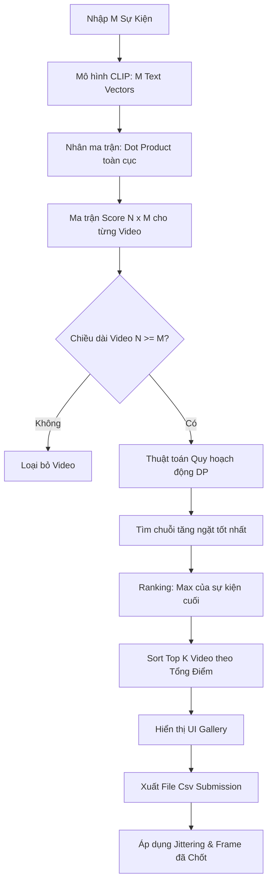

# Báo Cáo Kỹ Thuật: Thuật Toán Tìm Kiếm "Trake Mode"

Báo cáo này trình bày chi tiết về cách **Trake Mode Search** được xây dựng trong mã nguồn ứng dụng (bao gồm các module `trake.py`, `trake_dp.py`, và `trake_submission.py`), giải thích thuật toán, công thức toán học và luồng hoạt động cho tất cả các tình huống.

---

## 1. Ý Tưởng Và Ràng Buộc Cốt Lõi

Bài toán TRAKE yêu cầu hệ thống xử lý một đầu vào gồm chuỗi $M$ sự kiện (ví dụ: *1. Người đàn ông mở cửa -> 2. Người đàn ông cầm quả bóng -> 3. Người đàn ông ném bóng đi*).

**Ràng buộc ngặt (Strictly Increasing Constraint):** 
Các sự kiện này phải xảy ra theo **đúng thứ tự thời gian**. Nếu ánh xạ sự kiện $1$ vào khung hình $i_1$, sự kiện $2$ vào khung hình $i_2$, ..., thì bắt buộc phải thỏa mãn:
$$i_1 < i_2 < i_3 < ... < i_M$$

---

## 2. Công Thức Tính Điểm Keyframe (Independent Scoring)

Thay vì dùng FAISS để lọc Top-K (cách tiếp cận có thể làm mất các keyframe quan trọng để nối chuỗi), hệ thống quét toàn cục (Exhaustive Search).

*   **Tính toán Vector:** Hàm `encode_events` dùng mô hình học máy (CLIP) để biến $M$ câu mô tả thành ma trận truy vấn $Q$ (kích thước $M \times 512$).
*   **Mức điểm:** Với toàn bộ kho cơ sở dữ liệu keyframes $V$ (kích thước $N_{total} \times 512$), mức điểm độc lập $s_{i,j}$ (điểm của keyframe thứ $i$ cho sự kiện thứ $j$) chính là **Tích vô hướng (Dot Product / Cosine Similarity)** giữa vector ảnh và vector chữ.
*   **Mã code tương ứng (`trake.py`):**
    ```python
    scores = self.embeddings @ query_matrix.T
    ```
    Ma trận `scores` lúc này có kích thước $N_{total} \times M$. Bước này chạy cực nhanh nhờ tận dụng phép nhân ma trận Numpy trực tiếp trên bộ nhớ `mmap`.

---

## 3. Thuật Toán Quy Hoạch Động (Dynamic Programming)

Sau khi có ma trận điểm `scores`, code sẽ chia ma trận này ra theo từng Video (chiều dài mỗi video là $N$). Nhiệm vụ là tìm chuỗi $i_1 < i_2 < ... < i_M$ sao cho tổng điểm $\sum s_{i_k, k}$ là lớn nhất. Quá trình này nằm ở hàm `dp_best_path(s)` trong `trake_dp.py`.

### Công thức Quy hoạch động (DP)

Gọi $DP[i, j]$ là **Tổng điểm tối đa** tính đến sự kiện thứ $j$, kết thúc **chính xác tại keyframe $i$**.

*   **Trạng thái khởi tạo (Sự kiện đầu tiên $j = 0$):**
    $$DP[i, 0] = s_{i, 0}$$
*   **Chuyển trạng thái (Các sự kiện tiếp theo $j > 0$):**
    Để sự kiện $j$ xảy ra ở keyframe $i$, sự kiện $j-1$ phải nằm ở một keyframe $k$ nào đó xảy ra **trước** $i$ ($k < i$). Ta chọn điểm cao nhất trong các phương án:
    $$DP[i, j] = s_{i, j} + \max_{0 \le k < i} (DP[k, j-1])$$
*   **Mức điểm Xếp hạng Video (Ranking Score):**
    Chính là giá trị cao nhất tại cột sự kiện cuối cùng ($M-1$):
    $$TotalScore = \max_i DP[i, M-1]$$

### Chiêu thức Tối ưu hóa (Optimization)

Nếu dùng 3 vòng lặp lồng nhau cho công thức trên, độ phức tạp sẽ là $\mathcal{O}(N^2 \cdot M)$ — quá chậm. Thuật toán dùng kỹ thuật **cộng dồn cực đại (running max)** thông qua biến `best_prefix`. Nhờ lưu giữ biến `max` khi duyệt qua hàng $i$, độ phức tạp được giảm xuống chỉ còn $\mathcal{O}(N \cdot M)$.

---

## 4. Luồng Hoạt Động Cho Các Trường Hợp (Cases)



1.  **Case 1: Video quá ngắn (Không đủ chứa sự kiện)**
    *Ví dụ: Video chỉ có 2 keyframe nhưng người dùng tìm chuỗi 3 sự kiện.*
    Ngay đầu hàm `dp_best_path`: `if length < events: return None`. Video này bị loại ngay lập tức.
    
2.  **Case 2: Truy vết tìm chuỗi keyframe tốt nhất (Backtracking)**
    Mảng `backtrack[i, j]` được dùng để lưu lại bước nhảy. Khi tìm được $TotalScore$, thuật toán sẽ chạy ngược từ sự kiện cuối về sự kiện đầu tiên để "vớt" ra chính xác ID của các keyframes tối ưu đó.
    
3.  **Case 3: Xếp hạng Toàn cục**
    Sau khi tính DP cho mọi video, hệ thống sắp xếp danh sách các Video giảm dần theo $TotalScore$ và hiển thị ra UI.
    
4.  **Case 4: Xuất File Nộp Bài (Kèm Sinh Nhiễu - Jittering)**
    Trong `trake_submission.py`, hệ thống không nộp 1 phương án mà nộp 34 dòng mỗi video. Nó cộng/trừ một hằng số ngẫu nhiên (`SPREAD_RADIUS = 40`) vào các keyframe tối ưu để tạo ra nhiều phương án rải rác. Hàm `_clamp_increasing()` ép buộc các số bị sinh nhiễu chệch nhịp phải quay lại tuân thủ nguyên tắc tăng dần ($f_1 \le f_2 \le f_3...$).
    
5.  **Case 5: Chốt khung thủ công (Pin Frame)**
    Nếu UI chọn sai sự kiện, người dùng có thể xem video và nhấn "Chốt Frame". Tọa độ của khung hình được ưu tiên đẩy vào `pinned_frames`. Khi xuất file nộp bài, tọa độ do thuật toán tìm ra sẽ bị ghi đè bởi tọa độ chốt thủ công này. Các sự kiện chưa được chốt còn lại vẫn sẽ được jittering bình thường.
